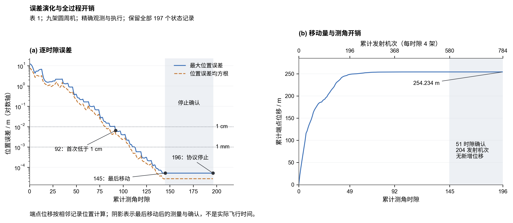
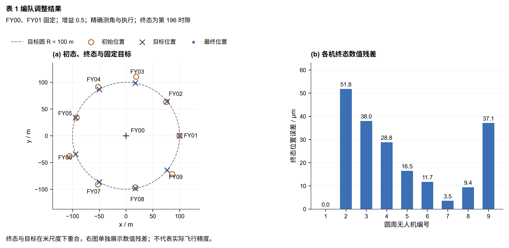
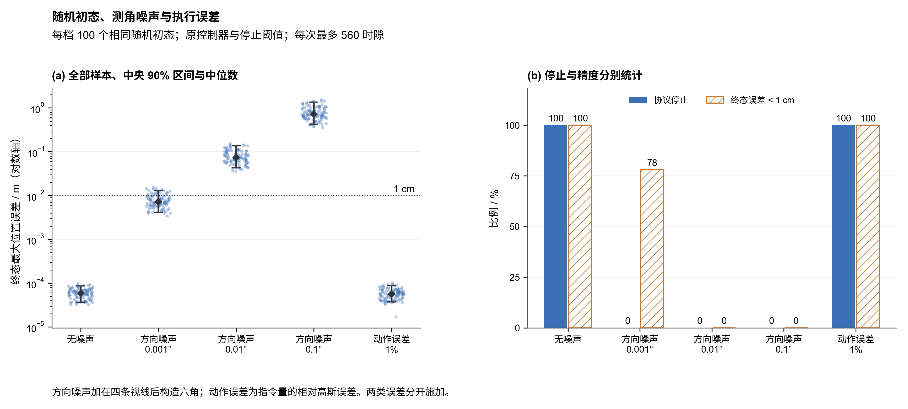
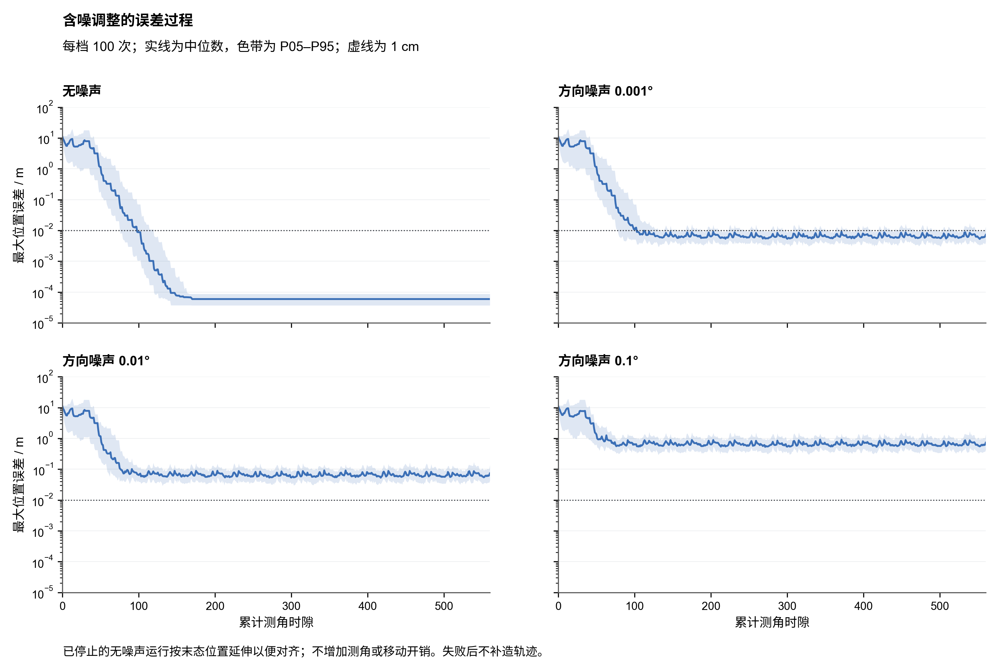

# 全配置轮换：完整推导与实验

本页保存正文重组前的完整 main 材料，便于查阅参数表、全轨迹、最终坐标和详细实验。当前论文正文见 [编队互校与调度改进](../../solutions/q1_3/README.md)，材料对应关系见 [资料索引](资料索引.md)。本页图号与章节编号只在此页内使用。

本问每次允许 FY00 与最多三架圆周无人机发射信号。针对表 1 的初始队形，目标是使九架圆周无人机恢复到半径 $100\,\mathrm{m}$、相邻角间隔 $40^\circ$ 的理想位置。采用“建立双偏差状态—公开轮换发射—本机择优估计—同步调整”的迭代方法，每架接收机利用自己的夹角观测，估计并修正径向、角向偏差。

表 1 中 FY00、FY01 已处于指定位置，因而作为固定且已标定的基准；FY02—FY09 均不预设为准确参考。精确观测与执行条件下，默认参数在第 92 个时隙首次达到厘米精度，第 145 个时隙完成最后一次移动，第 196 个时隙完成停止确认。该结果来自固定目标位置下的离线评价，控制器不读取真实坐标。

## 1. 双偏差状态模型

取 FY00 为原点，FY00 指向 FY01 为横轴正向，理想位置为

$$
Q_0=(0,0),\qquad
Q_k=R\begin{pmatrix}\cos\theta_k^0\\\sin\theta_k^0\end{pmatrix},
\qquad R=100\,\mathrm{m},\quad
\theta_k^0=\frac{2\pi(k-1)}9,\quad k=1,\ldots,9.
$$

表 1 的初态与编号目标如下：

| 无人机 | 初始半径 / m | 初始方位 / ° | 目标方位 / ° |
|:---|---:|---:|---:|
| FY00 | 0 | 0 | 圆心 |
| FY01 | 100 | 0 | 0 |
| FY02 | 98 | 40.10 | 40 |
| FY03 | 112 | 80.21 | 80 |
| FY04 | 105 | 119.75 | 120 |
| FY05 | 98 | 159.86 | 160 |
| FY06 | 112 | 199.96 | 200 |
| FY07 | 105 | 240.07 | 240 |
| FY08 | 98 | 280.17 | 280 |
| FY09 | 112 | 320.28 | 320 |

针对表 1，FY00、FY01 恰处于目标位置，因此将其作为已标定固定基准。FY02—FY09 的实际位置写成

$$
P_k=(R+\delta r_k)
\begin{pmatrix}
\cos(\theta_k^0+\delta\theta_k)\\
\sin(\theta_k^0+\delta\theta_k)
\end{pmatrix}.
$$

固定 FY01 后，目标队形的半径、朝向和编号对应关系随之确定，以下均直接评价固定目标位置。

其中 $\delta r_k$ 和 $\delta\theta_k$ 分别为径向、角向偏差，调整目标是使两者同时接近零。每架无人机已知自身编号、理想队形和公共时隙，利用本机夹角及自身历史状态作出决策。假设无人机可根据 FY00 的来向建立局部径向，并按照统一旋转方向精确完成相对径向位移与角向位移。

## 2. 公开发射轮换模型

将 FY02—FY09 的全部二元组合 $(a,b)$ 按编号字典序循环排列，每个时隙的发射集合及圆周发射集合分别为

$$
T=\{0,1,a,b\},\qquad C=\{1,a,b\},\qquad 2\leq a<b\leq9.
$$

FY00、FY01 和两架辅助机保持位置并发射，其余六架接收。每次先固定队形完成测角，再由各接收机独立计算、同时执行修正，随后进入下一时隙。每架接收机获得四个发射源之间的六个无向夹角，记为 $\alpha_{uv,k}^{\mathrm{obs}}$，角度计算统一采用弧度。

**一个测角时隙就是一次“测角—本机计算—同步执行”。** 四架同时发射、六架同时调整合计仍为一个时隙；继续测角但保持位置也计入时隙。累计时隙 $t=0$ 表示初始状态，第 $t$ 个时隙的误差按该次执行后的队形计算。

轮换表含 $\binom82=28$ 个时隙，每架待调整机发射 7 次、接收 21 次。28 时隙用于组织公开顺序与保持确认，调整效率以达到给定精度所需的累计时隙衡量。题目未规定单时隙时长，因此时隙数表示操作次数，尚不能换算为实际耗时。

## 3. 本机参考择优与双偏差估计

沿用已知发射位置下的角度观测方程，对候选接收位置 $p$ 定义

$$
h_{uv}(p)=\arccos\frac{(Q_u-p)^{\mathsf T}(Q_v-p)}
{\lVert Q_u-p\rVert\,\lVert Q_v-p\rVert}.
$$

辅助发射机尚有偏差时，观测由其实际位置产生，模型仍以编号对应的理想位置作为参考，因此本机估计会受到参考偏差的影响。每架接收机分别尝试 $S\in\{\{1,a\},\{1,b\},\{a,b\}\}$，每对与 FY00 构成三个定位发射点。

用 $z=(z_r,z_t)=(\widehat{\delta r},R\widehat{\delta\theta})$ 将两个估计变量统一到米的尺度，候选位置及局部最小二乘模型为

$$
\begin{aligned}
p_k(z)&=(R+z_r)
\begin{pmatrix}
\cos(\theta_k^0+z_t/R)\\
\sin(\theta_k^0+z_t/R)
\end{pmatrix},\\
z_{k,S}^*&=\underset{z}{\operatorname{argmin}}
\sum_{\{u,v\}\in\binom{\{0\}\cup S}{2}}
\left[h_{uv}(p_k(z))-\alpha_{uv,k}^{\mathrm{obs}}\right]^2.
\end{aligned}
$$

各参考对均从零偏差出发求取附近的解。计算范围取径向偏差 $\pm80\,\mathrm{m}$、角向偏差 $\pm60^\circ$，仅作求解保护。有效候选要求求解器成功、拟合残差范数小于 $10^{-8}\,\mathrm{rad}$ 且未触及范围边界；三对均无效时记录本机拟合失败并终止该次运行。该计算范围不代表已证明的收敛区域。三个夹角用于拟合，涉及第三架圆周发射机的另外三个夹角用于交叉核验。对每个有效候选，定义六角一致性残差与几何指标

$$
c_{k,S}=
\left[\sum_{\{u,v\}\in\binom T2}
\left(h_{uv}(p_k(z_{k,S}^*))-\alpha_{uv,k}^{\mathrm{obs}}\right)^2\right]^{1/2},
\qquad
\sigma_{k,S}=\sigma_{\min}\bigl(J_{k,S}(Q_k)\bigr).
$$

其中 $J_{k,S}$ 为该参考对三个预测夹角对笛卡尔位置的 Jacobian，在理想队形处计算；最小奇异值反映局部定位几何的稳定性。综合两项指标，选择

$$
S_k^*=\underset{S\text{ 为有效候选}}{\operatorname{argmax}}
\frac{\sigma_{k,S}}{1+c_{k,S}/s},
\qquad
\widehat{\delta r}_k=z_{r,k,S_k^*}^*,
\quad
\widehat{\delta\theta}_k=\frac{z_{t,k,S_k^*}^*}{R}.
$$

分数相同按参考编号顺序选择。该评分兼顾理想几何与本机完整观测的一致性，是参考选择的启发式规则；全部计算均在接收机本地完成。评分尺度 $s$ 与保持阈值分别设置。

## 4. 同步调整与停止规则

定义 $\operatorname{clip}(x,l,u)=\min(\max(x,l),u)$。选定参考后，接收机同时给出两项相对修正：

$$
\begin{aligned}
\Delta r_k&=\operatorname{clip}(-\eta\widehat{\delta r}_k,-d_r,d_r),&
r_k^+&=r_k+\Delta r_k,\\
\Delta\theta_k&=\operatorname{clip}(-\eta\widehat{\delta\theta}_k,-d_\theta,d_\theta),&
\theta_k^+&=\theta_k+\Delta\theta_k.
\end{aligned}
$$

增益控制修正幅度，限幅约束单次运动。若估计准确且限幅未触发，在调整状态下两种偏差都按系数 $1-\eta$ 缩小；辅助参考的位置偏差会影响估计，某项误差可能暂时增大，需要持续轮换和重新测角。

本机以选中候选的估计与六角残差计算

$$
\chi_k=\max\left(
\frac{|\widehat{\delta r}_k|}{\tau_r},
\frac{|\widehat{\delta\theta}_k|}{\tau_\theta},
\frac{c_{k,S_k^*}}{\tau_c}
\right).
$$

连续 21 次自身接收观测满足 $\chi_k\leq0.5$ 后进入保持，指令置零；未达标则重新计数，计数期间继续修正。21 次连续接收覆盖本机一个轮换中的全部接收配置。保持后继续测角，若 $\chi_k>1$，在当前时隙恢复调整。发射时保持当前位置，接收计数延续。

仿真在一个完整、与轮换表对齐的 28 时隙窗口中，全部接收决策均为保持后结束记录。该条件汇总控制状态用于停止确认；本机控制仍依据自身观测与记忆。默认最多运行 20 个周期，即 560 时隙，达到上限仍未满足条件时记录为未完成。实际持续运行时，各机可继续监听并按自己的指标恢复调整。

| 参数 | 默认值 | 含义 |
|:---|:---|:---|
| $\eta$ | $0.5$ | 修正增益 |
| $d_r,\ d_\theta$ | $5\,\mathrm{m},\ 2^\circ$ | 单时隙径向、角向限幅 |
| $s$ | $10^{-3}\,\mathrm{rad}$ | 参考评分尺度 |
| $\tau_r$ | $10^{-3}\,\mathrm{m}$ | 径向估计完整阈值 |
| $\tau_\theta,\ \tau_c$ | 均为 $10^{-5}\,\mathrm{rad}$ | 角向估计、六角残差完整阈值 |
| 连续达标次数 | 21 次本机接收 | 使用半阈值进入保持 |

整个调整过程如下：

1. 初始化 FY02—FY09 的本机计数与保持标志，按公开轮换表确定本时隙发射集合。
2. 发射机保持位置，各接收机测得自己的六个夹角。
3. 各接收机独立计算三个参考对的候选解与评分，选取偏差估计。
4. 更新本机保持状态，计算径向、角向修正；所有接收机同时执行。
5. 进入下一时隙；每个完整周期结束时检查停止确认条件，直到完成或达到运行上限。

实际坐标只用于仿真生成夹角、执行动作和离线评价；本机估计、评分和保持判断不读取实际坐标，也不交换其他接收机的观测。

## 5. 参考误差传播与局部收敛分析

### 5.1 参考偏差如何进入本机估计

令 $e_i=(\delta r_i,R\delta\theta_i)^{\mathsf T}$，按 FY02—FY09 的顺序组成 $e\in\mathbb R^{16}$。用 $D_i$ 表示理想位置处由径向、切向单位向量构成的正交矩阵，则 $\delta P_i=D_i e_i+O(\|e_i\|^2)$。

对于接收机 $i$ 的参考对 $S$，真实三角度观测在理想队形附近展开为

$$
y_{i,S}(e)=y_{i,S}(0)+H_{i,S}e+O(\|e\|^2).
$$

$H_{i,S}$ 同时包含接收机和辅助参考位置变化对夹角的影响。记 $G_{i,S}=J_{i,S}(Q_i)D_i$ 为预测角度对本机米尺度偏差的 Jacobian。若其满列秩，局部最小二乘正规方程给出

$$
\widehat e_i
=(G_{i,S}^{\mathsf T}G_{i,S})^{-1}G_{i,S}^{\mathsf T}H_{i,S}e+O(\|e\|^2)
=e_i+\sum_{j\in S\cap\{2,\ldots,9\}}B_{ij,S}e_j+O(\|e\|^2).
$$

矩阵 $B_{ij,S}$ 描述参考机 $j$ 的径向、角向偏差对接收机 $i$ 估计的影响。FY00、FY01 固定，不含未知误差项。第三架圆周发射机通过一致性评分影响参考选择；在选择不变的局部邻域中，它不直接进入当前拟合的传播矩阵。

因此，本机估计包含自身偏差和参考传播项。减去估计值后可能暂时放大某个误差分量，稳定性需要从完整轮换过程判断。

### 5.2 完整周期映射

在目标附近、参考选择固定、限幅未触发并持续执行修正时，有

$$
e_i^+=(1-\eta)e_i-\eta\sum_jB_{ij,S}e_j+O(\|e\|^2).
$$

当前发射机的状态直接保留。将六架接收机同步更新与发射机保持共同写成单时隙矩阵 $M_t$，定义完整周期映射 $\Phi_\eta$，则

$$
e^{(q+1)}=\Phi_\eta(e^{(q)}),\qquad
\Phi_\eta(e)=A_\eta e+O(\|e\|^2),\qquad
A_\eta=M_{28}M_{27}\cdots M_1.
$$

各矩阵均使用该时隙执行前的状态，符合实际程序的同步更新顺序。

在理想队形处枚举全部 $28\times6=168$ 个接收决策，最优参考对均唯一，最佳与次佳评分的最小相对差距约为 $0.4856\%$。在准确局部解连续存在的条件下，目标附近存在参考选择不变的邻域。这个评分差距不等于可容许的位置偏差。

### 5.3 数值稳定性依据与适用范围

解析构造的周期矩阵结果如下。范数对应上述米尺度误差的欧氏范数。

| 增益 $\eta$ | 谱半径 $\rho(A_\eta)$ | $\|A_\eta\|_2$ | $\|A_\eta^2\|_2$ |
|---:|---:|---:|---:|
| 0.25 | 0.247957 | 1.178549 | 0.299297 |
| 0.5 | 0.079220 | 2.542205 | 0.191932 |
| 1 | 约 $1.81\times10^{-8}$ | 5.133855 | 0.506806 |

默认增益下 $\rho(A_{0.5})\approx0.07922<1$，且 $\|A_{0.5}^2\|_2\approx0.19193<1$。令 $F=\Phi_{0.5}\circ\Phi_{0.5}$，则 $DF(0)=A_{0.5}^2$。在映射光滑的条件下，由导数连续性，存在足够小的邻域使 $\|DF(e)\|_2<1$；于是两周期映射局部收缩，偶数周期误差趋于零，连续性进一步保证奇数周期及中间时隙误差也趋于零。

这为持续修正核心提供了局部渐近稳定的数值依据。单周期范数大于 1，说明某些小误差方向可以暂时放大，与重复周期后的渐近衰减并不矛盾。增益 1 的近零谱半径受浮点计算影响，不能据此断言非线性算法在有限几个周期内精确到达目标。

使用原本机求解器执行完整周期中心差分：三个增益、16 个坐标方向、正负扰动和三个步长，共 288 次周期探测。所有探测均无参考切换、无限幅、无拟合失败；默认增益在 $10^{-3}\,\mathrm{m}$ 差分步长下，解析矩阵与差分矩阵的相对 Frobenius 误差约为 $8.89\times10^{-8}$。更小步长受到求解容差和舍入影响。这里提供双精度计算与独立微扰核验，未提供区间算术的严格数值误差界。

上述分析要求精确观测与执行、准确局部解、目标附近固定参考分支以及持续修正。完整控制器还包含保持标志与连续计数；进入保持区域后可以保留非零位置误差，其位置映射可以为恒等映射。因此局部矩阵不能直接证明完整停止协议的真实误差趋零，也未证明表 1 初态处于该收敛邻域。完整算法的实际效果由仿真单独评价。

## 6. 表 1 的调整结果与代价评价

### 6.1 评价指标

九架圆周机的最大位置误差和均方根误差定义为

$$
E_{\max}(t)=\max_{1\leq k\leq9}\|P_k(t)-Q_k\|_2,\qquad
E_{\mathrm{rms}}(t)=\sqrt{\frac19\sum_{k=1}^9\|P_k(t)-Q_k\|_2^2}.
$$

FY01 固定且误差为零，仍纳入 RMS 的九机分母；FY00 不纳入圆周机误差。效率与代价另用累计测角时隙 $N_{\mathrm{slot}}=t$、累计发射机次和累计端点位移表示：

$$
C_{\mathrm{tx}}(t)=\sum_{\tau=1}^t|T_\tau|=4t,\qquad
L_{\mathrm{move}}(t)=
\sum_{\tau=1}^t\sum_{k=0}^9\|P_k(\tau)-P_k(\tau-1)\|_2.
$$

四架同时发射计一个时隙、四个发射机次；保持期间继续发射和测角也计入。题面未给信号脉冲频率、发射功率、单时隙时长或时隙内飞行路径，因此这里不将发射机次换算为实际报文数或能耗，也不将端点位移当成真实航程。精度与代价分别报告。

### 6.2 误差下降与停止开销

默认参数得到下列轨迹，数值来自执行后的队形记录。

| 累计测角时隙 | 最大位置误差 / m | 位置误差 RMS / m |
|---:|---:|---:|
| 0 | 12.011140 | 7.414802 |
| 28 | 2.153027 | 1.373278 |
| 56 | 0.214392 | 0.124854 |
| 84 | 0.014876 | 0.008002 |
| 112 | 0.00102033 | 0.00049196 |
| 140 | 0.00007264 | 0.00003743 |
| 145 | 0.00005180 | 0.00002758 |
| 196 | 0.00005180 | 0.00002758 |

图 1 保留初态和执行后的全部 197 个状态。误差曲线采用对数轴，阴影表示最后移动后的测量与确认过程。各精度门槛只用于离线评价，不参与本机停止判断。

| 事件 | 时隙 | 累计发射机次 | 累计端点位移 / m |
|---|---:|---:|---:|
| 首次最大误差小于 2 cm | 80 | 320 | 253.947021 |
| 首次最大误差小于 1 cm | 92 | 368 | 254.121600 |
| 首次最大误差小于 1 mm | 113 | 452 | 254.221758 |
| 最后一次非零移动 | 145 | 580 | 254.233789 |
| 完成停止确认 | 196 | 784 | 254.233789 |

三个精度门槛首次达到后，在该表 1 运行的后续记录中均保持达标。第 146—196 时隙没有新增位移，共 51 时隙、204 发射机次；其中第 169—196 时隙构成与轮换表对齐的最终完整保持窗口。因此，厘米精度所需的 92 时隙、结束移动的 145 时隙与完整协议停止的 196 时隙分别回答不同的效率问题。

该表 1 运行共产生 1176 次接收机决策、850 次非零单机动作，局部拟合失败数为零。最大角向误差从初始 $0.28^\circ$ 增至第 28 时隙的 $1.156372^\circ$，随后下降，表明两个误差分量存在明显耦合；全过程并非逐时隙单调改善。

### 6.3 最终队形与位置

图 2 的平面坐标采用相同尺度。最终位置在米尺度下与固定目标重合，右图单独显示各机数值残差。目标圆的圆心、半径与编号方向均按题面基准固定，没有重新拟合圆心、半径或旋转角来吸收误差。

第 196 时隙的最终坐标如下，坐标保留六位小数，位置误差由未舍入数据计算。

| 无人机 | 最终 $x$ / m | 最终 $y$ / m | 位置误差 / µm |
|---|---:|---:|---:|
| FY00 | 0.000000 | 0.000000 | 0.000 |
| FY01 | 100.000000 | 0.000000 | 0.000 |
| FY02 | 76.604489 | 64.278734 | 51.804 |
| FY03 | 17.364855 | 98.480785 | 38.008 |
| FY04 | -50.000000 | 86.602569 | 28.788 |
| FY05 | -93.969275 | 34.202025 | 16.472 |
| FY06 | -93.969267 | -34.202004 | 11.717 |
| FY07 | -50.000001 | -86.602537 | 3.548 |
| FY08 | 17.364809 | -98.480779 | 9.392 |
| FY09 | 76.604439 | -64.278798 | 37.118 |

末态最大位置误差为 $5.18045\times10^{-5}\,\mathrm{m}$，RMS 为 $2.75766\times10^{-5}\,\mathrm{m}$；最大径向误差为 $2.47911\times10^{-5}\,\mathrm{m}$，最大角向误差与最大相邻角间隔误差均约为 $(2.80713\times10^{-5})^\circ$。这些数值描述精确模型中的数值残差，实际飞行精度仍取决于测角与动作执行误差。

## 7. 参数敏感性与有限初态扰动

### 7.1 增益与运动限幅

保持其他条件相同，对增益、径向限幅和角向限幅分别作单因素检查。七种配置均完成原停止流程，且没有局部拟合失败。

| 配置 | 首次低于 1 cm 时隙 | 完整停止时隙 | 完整发射机次 | 总端点位移 / m |
|---|---:|---:|---:|---:|
| 增益 0.25 | 103 | 224 | 896 | 95.767 |
| 默认：增益 0.5，径向 5 m，角向 2° | 92 | 196 | 784 | 254.234 |
| 增益 1 | 141 | 196 | 784 | 1516.405 |
| 径向限幅 2.5 m | 80 | 196 | 784 | 196.908 |
| 径向限幅 10 m | 86 | 196 | 784 | 268.774 |
| 角向限幅 1° | 98 | 196 | 784 | 270.709 |
| 角向限幅 4° | 92 | 196 | 784 | 257.474 |

增益 1 的局部谱半径最小，但表 1 全过程的首次厘米达标更晚，累计位移约为默认值的 5.96 倍。这说明局部渐近速度不能替代全过程代价评价。增益 0.25 的移动量更少，代价是完整停止多用 28 时隙、112 发射机次。默认增益 0.5 在发射次数与移动量之间提供了一种取舍，现有结果没有证明其最优。

正的限幅在足够小的目标邻域内不触发，因此不会改变原点处的局部 Jacobian，却能改变远离目标时的轨迹。径向限幅 $2.5\,\mathrm{m}$ 在表 1 中比默认配置更早达到厘米精度、累计位移也更少；默认配置保留为全文的统一基线。单一算例不足以据此判定某个限幅全局更优。

径向限幅 10 m 的曲线首次达到厘米精度后曾再次越界，故其 86 时隙只能解释为首次达标。其余配置在记录内首次厘米达标后均保持达标。完整数据见[参数评价](../../outputs/q1_3/main_analysis/table1_evaluation.csv)和[精度开销记录](../../outputs/q1_3/main_analysis/precision_costs.csv)。

### 7.2 有限初态扰动检查

除表 1 外，检查理想初态以及三组固定随机扰动：以理想队形为基础，对 FY02—FY09 的横纵坐标分别加入 $[-5,5]\,\mathrm{m}$ 均匀扰动，固定 FY00、FY01，随机种子为 20220905，使用默认参数。

| 初始状态 | 完整停止时隙 | 最终最大位置误差 / m | 局部拟合失败数 |
|---|---:|---:|---:|
| 理想队形 | 56 | 0 | 0 |
| 扰动 1 | 196 | $6.98094\times10^{-5}$ | 0 |
| 扰动 2 | 196 | $7.46454\times10^{-5}$ | 0 |
| 扰动 3 | 196 | $5.69730\times10^{-5}$ | 0 |

理想初态没有非零动作，56 时隙用于本机连续达标与完整保持确认。三组扰动均达到本机停止条件，最终最大误差均小于 1 cm。这些结果提供有限初态变化下的补充证据，样本量不足以估计一般成功率；本节未加入测角噪声或执行误差。

## 8. 随机初态、测角噪声与执行误差实验

### 8.1 实验设计与判定口径

为检验主模型的适用范围，保持控制器、增益、轮换顺序、拟合有效性判据及保持阈值不变，完成五档各 100 次随机初态实验，另对表 1 初态每档单独运行一次，共 505 次。表 1 的五次运行不混入随机成功率。

固定 FY00、FY01；FY02—FY09 的初始径向偏差独立取 $U[-12,12]\,\mathrm{m}$，初始角偏差独立取 $U[-0.3,0.3]^\circ$。这些范围仅用于实验抽样，不解释为题面承诺的偏差上界。五档使用相同的 100 个初态，随机初态种子为 20260905；噪声按试验编号、时隙、接收机及观测/执行类别确定独立随机流，使配对比较可复现。

方向噪声施加到本机对四个发射源的视线方向。令真实方向为 $\beta_{ik}$，加入独立噪声后构造无向夹角：

$$
\widetilde\beta_{ik}=\beta_{ik}+\varepsilon_{ik},\qquad
\varepsilon_{ik}\sim N(0,\sigma_\beta^2),\qquad
\widetilde\alpha_{uv,i}
=\left|\operatorname{atan2}\!\left(
\sin(\widetilde\beta_{iu}-\widetilde\beta_{iv}),
\cos(\widetilde\beta_{iu}-\widetilde\beta_{iv})
\right)\right|.
$$

由此，同一条视线参与的夹角自然相关；远离 $0$、$\pi$ 的夹角，其噪声标准差近似为 $\sqrt2\sigma_\beta$。表中的 $0.001^\circ$、$0.01^\circ$、$0.1^\circ$ 均指单条视线方向的标准差，不能误读成六个独立夹角各自的标准差。控制器仍只收到六个夹角，不获知真实方向或噪声样本。

执行误差单独设置一档：精确测角下，将径向和角向指令分别乘以独立的 $1+\xi_r$、$1+\xi_\theta$，其中 $\xi_r,\xi_\theta\sim N(0,0.01^2)$。它表示指令量的 1% 相对执行误差，零指令仍为零。没有同时施加方向噪声，也未包含常值偏置、漂移、异步或阵风。

所有运行最多 560 时隙。分别记录协议停止、末态最大误差小于 1 cm，以及两者同时成立的联合成功；拟合失败和用满预算的运行全部保留。厘米门槛是统一评价线，未加入本机控制。对未停止的运行，“末态”指第 560 时隙的预算终点，不能称为收敛终态。

### 8.2 误差与停止结果

| 条件 | 停止 / 100 | 末态小于 1 cm / 100 | 联合成功 / 100 | 最大误差中位数 / m | 最大误差 P95 / m |
|---|---:|---:|---:|---:|---:|
| 无噪声 | 100 | 100 | 100 | 5.89865e-05 | 8.68407e-05 |
| 方向噪声 $0.001^\circ$ | 0 | 78 | 0 | 0.00719884 | 0.0131968 |
| 方向噪声 $0.01^\circ$ | 0 | 0 | 0 | 0.0727504 | 0.136276 |
| 方向噪声 $0.1^\circ$ | 0 | 0 | 0 | 0.724034 | 1.35589 |
| 相对动作误差 1% | 100 | 100 | 100 | 5.6541e-05 | 8.81175e-05 |

图 3 的每个散点是一项独立初态试验，区间表示 P05–P95，全部成功、超时和失败都包含在分母中。中位数和 P95 描述这批样本分布，不是任意初态下的保证。

无噪声下，100 个随机初态中 100 个完成停止，100 个同时满足厘米精度。方向噪声为 $0.001^\circ$ 时，末态最大误差中位数为 0.720 cm，78/100 个末态达到厘米精度，但 0/100 个触发原协议停止。其 P95 为 1.320 cm，说明不能用中位数代替所有运行的精度。

方向噪声增加到 $0.01^\circ$ 和 $0.1^\circ$ 时，末态最大误差中位数分别为 7.275 cm 和 72.403 cm。在 1% 相对执行误差这一单独档位，100/100 个运行完成停止并达到厘米精度。由于这种执行误差随指令缩小而缩小，该结果不能外推到具有固定绝对误差或持续漂移的执行器。

| 条件 | 联合成功比例 | Wilson 95% 区间 | 拟合失败次数（运行数） | 预算耗尽运行数 |
|---|---:|---:|---:|---:|
| 无噪声 | 100% | [96.30%, 100.00%] | 0 | 0 |
| 方向噪声 $0.001^\circ$ | 0% | [0.00%, 3.70%] | 0 | 100 |
| 方向噪声 $0.01^\circ$ | 0% | [0.00%, 3.70%] | 0 | 100 |
| 方向噪声 $0.1^\circ$ | 0% | [0.00%, 3.70%] | 0 | 100 |
| 相对动作误差 1% | 100% | [96.30%, 100.00%] | 0 | 0 |

Wilson 区间以独立抽取初态的二项模型计算，只对应声明的抽样分布。五档初态互相配对，不能把五档当成 500 个独立初态合并估计一个总成功率。

### 8.3 噪声平台及全过程代价

无噪声的已停止运行在图中按末态位置延伸，以对齐横轴；延伸不增加操作次数或移动量。含噪曲线显示，初始偏差衰减后，误差进入持续波动的区间。原保持规则要求连续 21 次本机观测达到很小的半阈值，这与三个方向噪声档不匹配，控制器持续修正并用满预算。协议未停止和误差完全失控是不同的现象，两者需要分别统计。

| 条件 | 总时隙中位数 | 发射机次中位数 | 累计端点位移中位数 / m | 累计端点位移 P95 / m |
|---|---:|---:|---:|---:|
| 无噪声 | 196 | 784 | 401.389 | 739.051 |
| 方向噪声 $0.001^\circ$ | 560 | 2240 | 410.099 | 746.702 |
| 方向噪声 $0.01^\circ$ | 560 | 2240 | 490.052 | 823.471 |
| 方向噪声 $0.1^\circ$ | 560 | 2240 | 1329.715 | 1637.195 |
| 相对动作误差 1% | 196 | 784 | 401.914 | 742.097 |

含噪档的 2240 发射机次包含完整的 560 时隙预算。后期微小修正仍会累计移动代价，因此不能只看末态误差，也不能将达到过一次厘米精度当成此后稳定保持。原始结果同时保存首次达标时隙、记录内持续达标起点和末 28 时隙平均最大误差。

### 8.4 噪声传播的局部解释

在目标附近且参考选择固定时，设 $D_{i,S}$ 为所选三条无向夹角对三条有向视线的导数，$G_{i,S}$ 沿用第 5 节。三条观测噪声的协方差为 $\sigma_\beta^2D_{i,S}D_{i,S}^{\mathsf T}$，不应替换为独立同方差的单位阵。

将本机估计噪声经增益传入同步更新，可以得到

$$
e_{t+1}=M_t e_t+W_t\varepsilon_t+O(\|e_t\|^2+\|\varepsilon_t\|^2),\qquad
\Sigma_{t+1}=M_t\Sigma_tM_t^{\mathsf T}+\sigma_\beta^2W_tW_t^{\mathsf T}.
$$

其中 $W_t$ 的本机行块由 $-\eta G_{i,S}^{+}D_{i,S}$ 构成，不同接收机的方向噪声相互独立。把一周期的噪声注入依次传播，得到周期协方差 $Q_\eta$，稳态周期端点协方差满足离散 Lyapunov 方程

$$
\Sigma_*=A_\eta\Sigma_*A_\eta^{\mathsf T}+\sigma_\beta^2Q_\eta.
$$

由于 $\rho(A_\eta)<1$，固定分支的线性模型存在有限协方差；持续随机注入使误差维持在噪声平台，而非趋于零。模型预测 $\sqrt{\mathbb E[E_{\mathrm{rms}}^2]}$ 随 $\sigma_\beta$ 成正比。下表使用相同统计量对照原算法预算端点结果，既不混用最大误差，也不把 RMS 中位数与二阶矩混比。

| 方向噪声标准差 / ° | 固定分支预测 / m | 原算法实测 / m | 实测 / 预测 |
|---:|---:|---:|---:|
| 0.001 | 0.00454273 | 0.00453024 | 0.9973 |
| 0.01 | 0.0454273 | 0.0455369 | 1.0024 |
| 0.1 | 0.454273 | 0.455493 | 1.0027 |

原算法实测列取该噪声档所有预算耗尽试验的 $\sqrt{n^{-1}\sum_\ell E_{\mathrm{rms},\ell}^2}$，对应第 560 时隙，即完整周期端点。解析预测固定理想参考分支并忽略保持和限幅；原算法允许参考切换，所以两列存在差异并不矛盾。这个分析用于解释平台量级，不给出非线性最大误差的概率上界。

### 8.5 对完整方案的判断

随机初态与相对执行误差实验补强了原模型的有限算例证据；方向噪声实验同时明确了它的适用边界：持续修正可以降低初始误差，但原有极小保持阈值未能在三个方向噪声档完成停止。不据此宣称“含噪也成功收敛并停止”。

因此，表 1 的计算采用精确模型及其原停止规则；含噪部分使用预先声明的有限预算评价误差分布与代价，预算终止明确标为预算终止。按噪声放宽阈值会改变停止行为，不能自动保证厘米精度；报告中也不剔除超时运行。真实设备的精度要求、噪声标定及执行误差模型须由具体应用给定，超出本题仿真结论的范围。

## 9. 本问结论与模型适用范围

在表 1 初态、固定已标定 FY00/FY01、精确夹角观测、公开同步轮换与精确相对极坐标执行条件下，该方法通过本机双偏差估计和轮换反馈，将九架圆周无人机调整到指定目标附近。默认运行在 92 个时隙达到厘米精度，在 145 个时隙完成最后移动，在 196 个时隙完成协议停止；总计 784 发射机次、254.234 m 累计端点位移。

该方法的依据由三个部分组成：参考误差传播式解释估计耦合；完整周期矩阵提供持续修正机制的局部稳定性依据；表 1、参数和有限扰动仿真验证完整保持协议在这些算例中的效果。接收机利用自身夹角及预先已知的编队和轮换信息作出调整，无需先将一架辅助发射机校准为额外的精确参考。

模型尚未建立完整保持指标到真实位置误差的统一上界，也没有给出一般初始偏差的收敛保证。第 8 节给出随机初态、三档方向噪声和一档相对执行误差的有限样本结果：原停止规则在方向噪声下未完成停止确认，预算终点误差随噪声增大。本文结论限定于已说明的模型条件和已运行算例，不外推到未经建模的系统偏置、异步运动或真实设备。

## 10. 复现与证据来源

在仓库根目录运行：

~~~bash
conda run --no-capture-output -n agent python -m scripts.q1_3.run_adjustment
conda run --no-capture-output -n agent python -m scripts.q1_3.run_sensitivity
conda run --no-capture-output -n agent python -m scripts.q1_3.analyze_iterative_reference
conda run --no-capture-output -n agent python -m scripts.q1_3.plot_main_results
conda run --no-capture-output -n agent python -m scripts.q1_3.run_robustness --trials 100 --workers 4
conda run --no-capture-output -n agent python -m scripts.q1_3.analyze_noise_floor
conda run --no-capture-output -n agent python -m scripts.q1_3.report_robustness
~~~

控制器见[本机调整实现](../../scripts/q1_3/local_adjustment.py)，求解容差、失败处理与测试说明见[验证记录](../../docs/q1_3/验证记录.md)，矩阵构造和导数核验见[局部收敛与评价技术说明](../../docs/q1_3/main局部收敛与评价.md)。图表统计口径见[图表说明](../../docs/q1_3/main收尾计划与图表说明.md)。

原始数据包括[完整汇总](../../outputs/q1_3/summary.json)、[逐时隙误差与开销](../../outputs/q1_3/error_history.csv)、[位置记录](../../outputs/q1_3/positions.csv)、[公开发射表](../../outputs/q1_3/transmitter_schedule.csv)、[逐机动作](../../outputs/q1_3/adjustment_steps.csv)、[初态敏感性](../../outputs/q1_3/sensitivity.csv)及[周期稳定性指标](../../outputs/q1_3/main_analysis/gain_stability.csv)。所有表格与图形均基于这些记录，完整第一问见[整体解法](../../solutions/q1/README.md)。

含噪实验的完整口径与复核记录见[随机初态与噪声验证](../../docs/q1_3/随机初态与噪声验证.md)，逐次明细见[trials.csv](../../outputs/q1_3/robustness/trials.csv)，汇总见[summary.csv](../../outputs/q1_3/robustness/summary.csv)。
