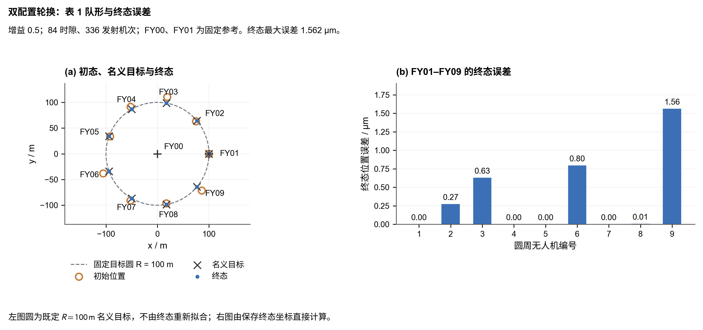
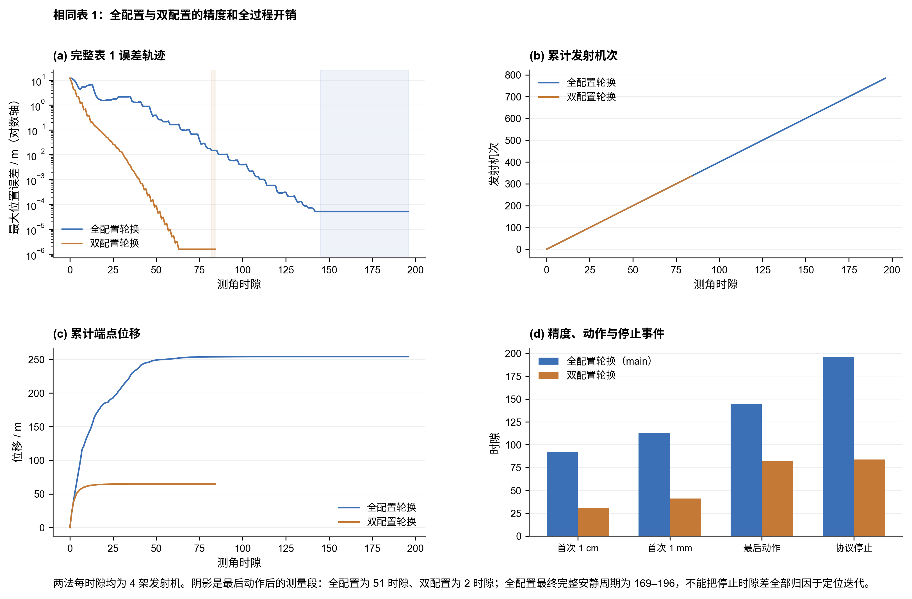
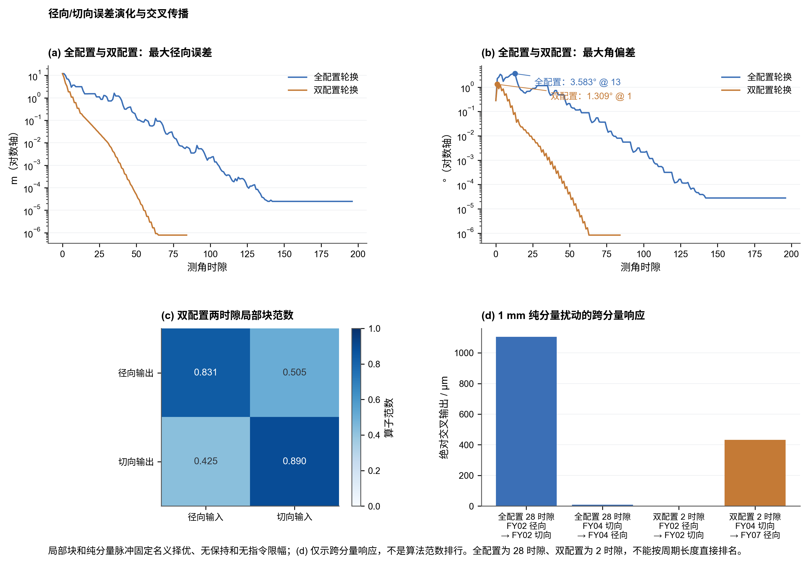
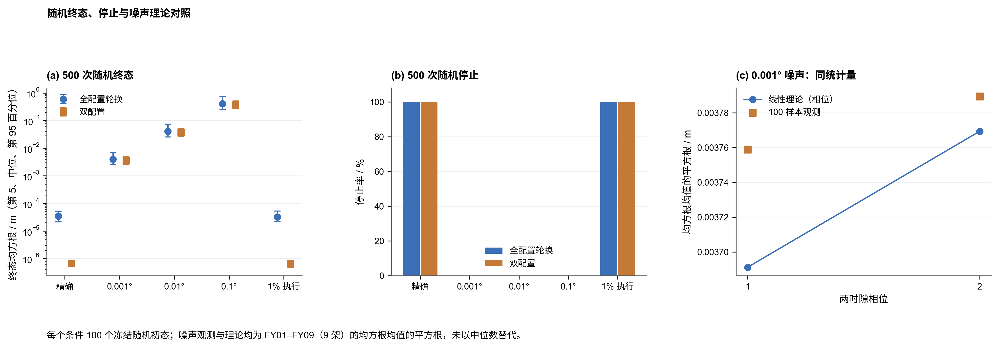

# 双配置轮换图表与归档

数学推导与参数结果见[双配置轮换互校分析](双配置轮换互校分析.md)，统一结论和独立核验见[分析验收](双配置轮换分析验收.md)。下列四组图已逐张目视审查；脚本、输入、绘图数据和全部导出的指纹见 [figure_manifest.json](../../figures/q1_3/two_configuration/figure_manifest.json)。

## 图表

图表由 `scripts/q1_3/plot_two_configuration_results.py` 生成，输出到 `figures/q1_3/two_configuration/`。每组均同时导出 PNG、SVG 和 PDF；`data/` 下的四份 CSV 是每张图实际绘制的完整数值序列，保留原始单位和统计口径。

1. `two_configuration_table1_formation_final` 使用冻结的默认增益 $0.5$ 表 1 初始、名义目标和终态坐标，展示等比例平面队形及 FY01--FY09 各机终态位置误差。目标圆为既定 $R=100\,\mathrm{m}$，不由终态重新拟合。
2. `main_vs_two_precision_cost` 对照 main 和双配置默认增益 $0.5$ 的完整表 1 轨迹：最大误差、累计发射机次、累计端点位移和首次持续 $1\,\mathrm{cm}$、$1\,\mathrm{mm}$、最后动作、协议停止事件。两种停止确认窗口不同，不能将总时隙差完全归因于定位迭代。
3. `radial_tangential_coupling` 展示表 1 的径向、角向误差以及两时隙局部矩阵的四个径向/切向块。交叉块非零，分量名称不表示两个独立的一维求解。图中的纯分量扰动和块范数固定名义择优、无保持和无指令限幅；main 的周期为 28 时隙、双配置为 2 时隙，不能据此跨周期直接比较成本或全局收敛性。
4. `random_terminal_stop_noise` 使用五个条件各 100 个冻结随机初态，合计 500 次；另有五个表 1 哨兵不混入随机分位数。噪声面板的观测与理论均报告 FY01--FY09 共 9 架的 $\sqrt{\operatorname{mean}(\mathrm{RMS}^2)}$，不以中位数或最大误差替代。理论适用于固定名义分支、未限幅、无保持的小噪声近似，实际停止和失败仍以冻结模拟记录为准。

运行：

```bash
conda run -n agent python scripts/q1_3/plot_two_configuration_results.py
```

图表读取 `outputs/q1_3/two_configuration_analysis/` 的正式分析 CSV、`outputs/q1_3/main_analysis/` 与 `outputs/q1_3/robustness/` 的 main 基线，以及 `outputs/q1_3/two_configuration_review/component_audit.json` 的独立交叉审查。脚本不运行蒙特卡洛、不修改任何冻结结果或参数。

## 冻结工作区归档

2026-09-06 已将根目录原有的两份实验工作区逐文件 SHA-256 核验后归档到 `scratch/q1_3_appendices_archive_20260906/workspace/appendix` 和 `scratch/q1_3_appendices_archive_20260906/workspace/appendix1`。根目录 `appendix`、`appendix1` 是指向这两个位置的相对符号链接，仍可供现有脚本、验证器和导入使用。

归档顶层的 `source_fingerprints_before.json`、`archive_hashes_after_copy.json`、`dependency_source_fingerprints*.json` 和 `archive_manifest.json` 分别记录移动前指纹、归档副本核验、相对 `ROOT` 依赖指纹及兼容链接切换。链接通过 macOS 的 `renameatx_np(RENAME_SWAP)` 原子交换安装，使入口不会短暂缺失。

`workspace/` 保留可复现的根目录布局：两份冻结目录、它们导入的脚本、题目与图片、Q1.3 文档、解答、旧图和旧基线输出。新一轮 `two_configuration_analysis`、`two_configuration_review` 及其图表不属于冻结旧结果，未写入本归档。`scratch/` 被 `.gitignore` 忽略，因此单独检出 Git 仓库不包含这些本地冻结证据；复现历史实验时需要保留该归档目录。

## 图形预览与导出

### 表 1 队形与末态误差



[PDF](../../figures/q1_3/two_configuration/two_configuration_table1_formation_final.pdf) · [SVG](../../figures/q1_3/two_configuration/two_configuration_table1_formation_final.svg)

### main 与双配置的完整误差和开销



[PDF](../../figures/q1_3/two_configuration/main_vs_two_precision_cost.pdf) · [SVG](../../figures/q1_3/two_configuration/main_vs_two_precision_cost.svg)

### 径向、切向误差及交叉传播



[PDF](../../figures/q1_3/two_configuration/radial_tangential_coupling.pdf) · [SVG](../../figures/q1_3/two_configuration/radial_tangential_coupling.svg)

### 随机终态、停止与小噪声预测



[PDF](../../figures/q1_3/two_configuration/random_terminal_stop_noise.pdf) · [SVG](../../figures/q1_3/two_configuration/random_terminal_stop_noise.svg)
