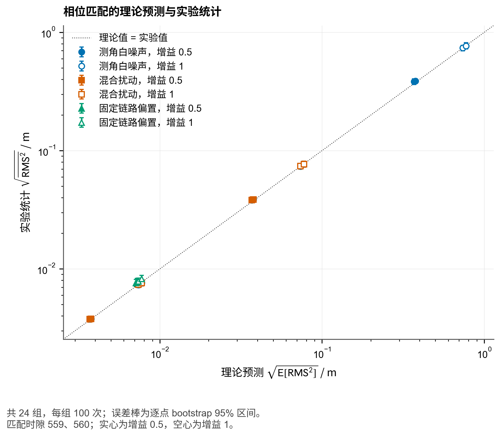
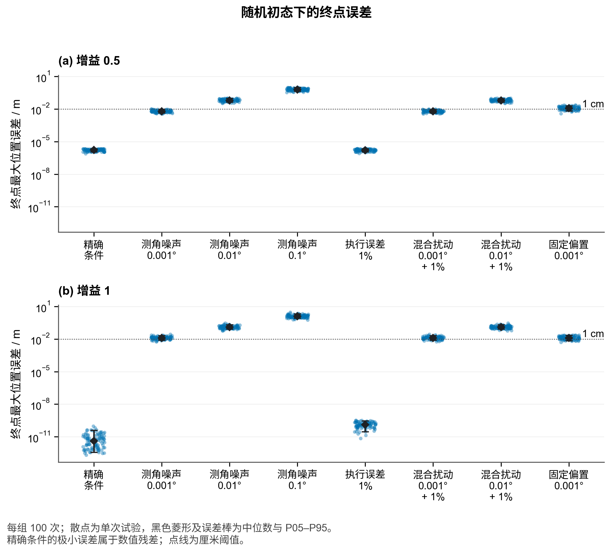
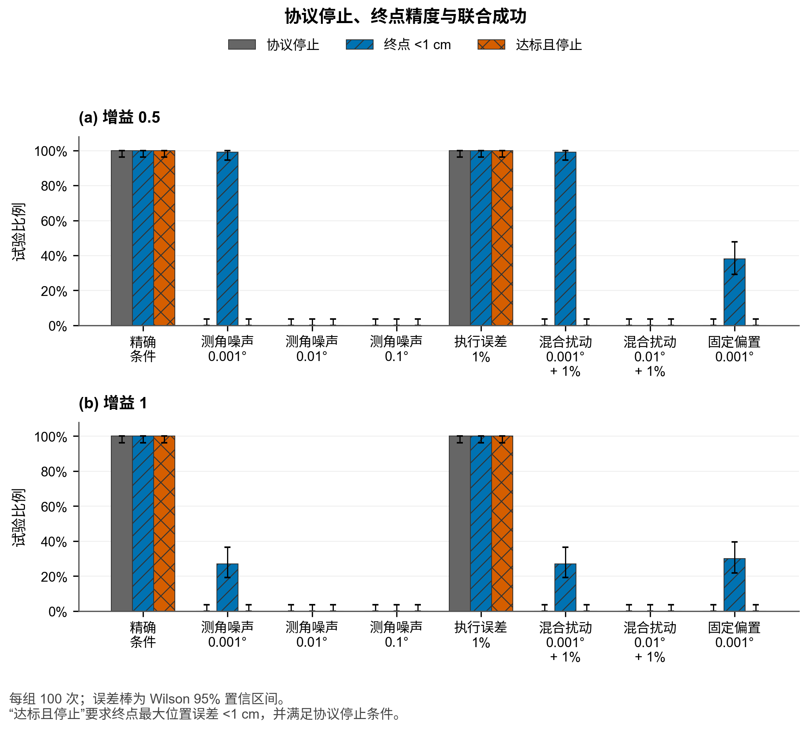
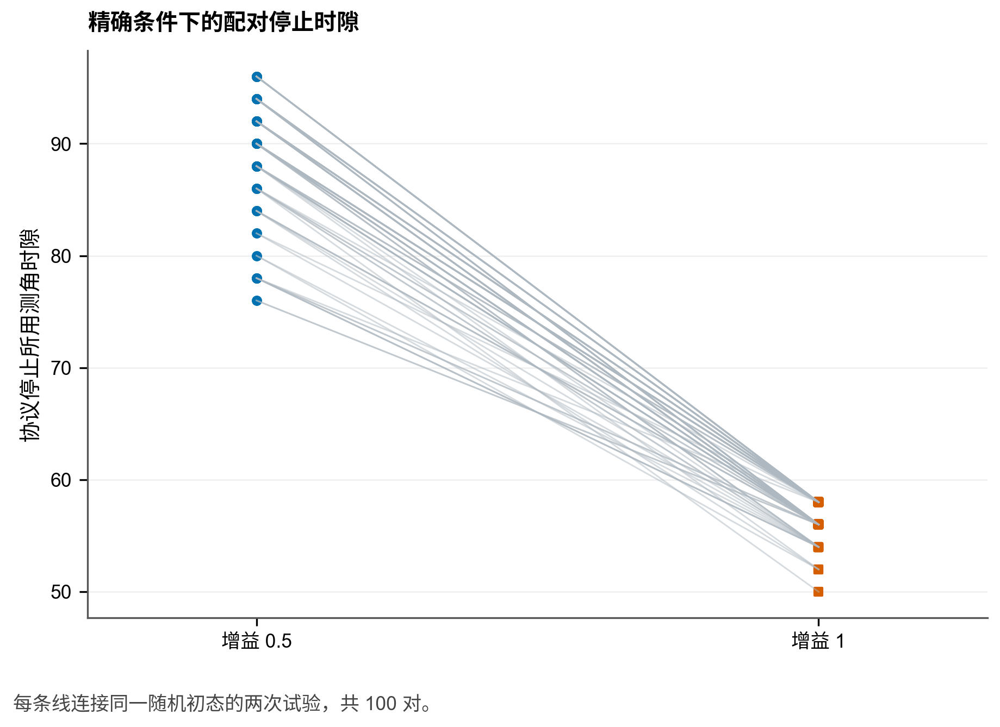
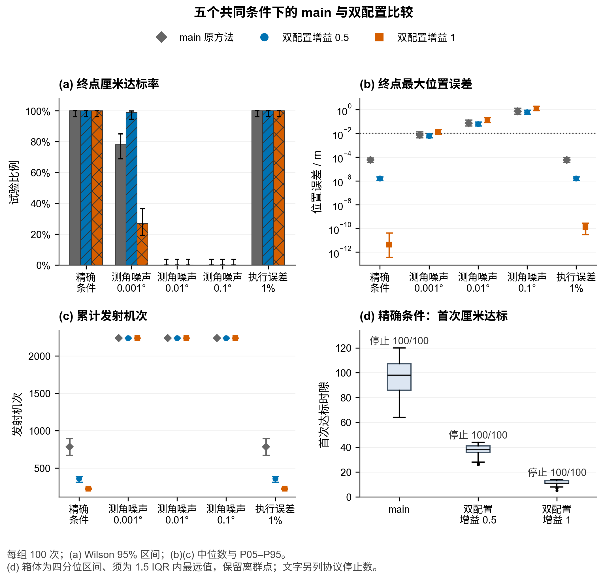

# 双配置轮换：随机初态、含噪与鲁棒性验证

本报告汇总固定双配置调度 $(0,1,4,5)$ 与 $(0,1,7,8)$ 下的随机初态和含噪实验。增益仅为 $0.5$ 与 $1$；每个增益、每个条件均在 560 个测角时隙预算内运行，未依据本批结果重新选择调度或参数。随机比例的分母是每条件 100 条试验；表 1 独立列出，不混入随机统计。

方向噪声表中的 $\sigma$ 是每条射线方向的独立白噪声标准差，并非把六个夹角各自独立加上同一标准差。在固定符号分支附近，一个由两条射线构成的夹角标准差为 $\sqrt{2}\sigma$，共享射线的夹角具有相关性。执行误差是每个径向/角向命令轴独立的零均值相对 $1\%$ 误差；真值位置仅由仿真器保存并用于事后评价，不输入本机定位或控制。

## 结论与取舍

- **精确测角或仅有 1% 相对执行误差时，增益 1 的停止开销更低。** 精确条件下两个增益均为 100/100 达标并停止；首次厘米时隙中位数从 38 降为 11，完整停止从 90 降为 56。增益 1 的端点位移中位数更高，具体成本在下表分别列出。
- **存在测角白噪声时，增益 0.5 的精度更好。** 0.001° 下终点厘米达标为 99/100，对比增益 1 的 27/100；再叠加 1% 执行误差后分别为 99/100 和 27/100。0.01°、0.1° 下两个增益的终点厘米达标均为 0/100，增益 0.5 只是误差水平较低，尚不能满足该精度要求。
- **固定链路偏置仍是明显限制。** 0.001° 偏置下两个增益的终点厘米达标分别为 38/100 和 30/100。其跨时隙相关性需要单独建模，不能用白噪声试验代替。
- **所有含测角白噪声或固定偏置的条件均为 0/100 协议停止。** 因而这些条件下还没有形成能够自行确认完成的方案；精度改善与完整停止保证应分别陈述。

上述取舍是对本批结果的解释，适用范围为固定调度、指定随机分布和预算。完整的增益差值及配对 bootstrap 区间在下文引用的数据表中。

exact 条件下接近 $10^{-12}$ m 的 gain $1$ 终点只是理想模型浮点数值残差，不对应实际设备可实现的定位能力；本文的实际精度判断仍以厘米和毫米阈值事件为主。

## 覆盖与来源

本次读取 1600 条随机记录与 16 条表 1 记录。`full_16x100_coverage=True`。试验运行器的合同、源文件哈希、复用来源和本报告脚本哈希均写入 [provenance.json](../../outputs/q1_3/two_configuration_robustness_report/provenance.json)。

## 随机试验结果

### 增益 $0.5$

| 条件 | 停止 / 100（Wilson 95%） | 终点 <1 cm / 100 | 终点 <1 mm / 100 | 联合 <1 cm / 100 | 终点最大误差 P05 / 中位 / P95（m） | 时隙中位数 | TX 中位数 | 位移中位数（m） |
|---|---:|---:|---:|---:|---:|---:|---:|---:|
| 精确条件 | 100 [96.3%, 100.0%] | 100 | 100 | 100 | 1.1e-06 / 1.64e-06 / 2.1e-06 | 90 | 360 | 79.8 |
| 测角噪声 0.001° | 0 [0.0%, 3.7%] | 99 | 0 | 0 | 0.00414 / 0.00614 / 0.00903 | 560 | 2240 | 88.9 |
| 测角噪声 0.01° | 0 [0.0%, 3.7%] | 0 | 0 | 0 | 0.0411 / 0.062 / 0.0908 | 560 | 2240 | 173 |
| 测角噪声 0.1° | 0 [0.0%, 3.7%] | 0 | 0 | 0 | 0.411 / 0.619 / 0.907 | 560 | 2240 | 1.03e+03 |
| 执行误差 1% | 100 [96.3%, 100.0%] | 100 | 100 | 100 | 1.08e-06 / 1.62e-06 / 2.15e-06 | 90 | 360 | 80 |
| 混合扰动 0.001° + 1% | 0 [0.0%, 3.7%] | 99 | 0 | 0 | 0.00414 / 0.00617 / 0.00888 | 560 | 2240 | 89 |
| 混合扰动 0.01° + 1% | 0 [0.0%, 3.7%] | 0 | 0 | 0 | 0.0411 / 0.062 / 0.0898 | 560 | 2240 | 173 |
| 固定链路偏置 0.001° | 0 [0.0%, 3.7%] | 38 | 0 | 0 | 0.00664 / 0.0118 / 0.0195 | 560 | 2240 | 84 |

### 增益 $1$

| 条件 | 停止 / 100（Wilson 95%） | 终点 <1 cm / 100 | 终点 <1 mm / 100 | 联合 <1 cm / 100 | 终点最大误差 P05 / 中位 / P95（m） | 时隙中位数 | TX 中位数 | 位移中位数（m） |
|---|---:|---:|---:|---:|---:|---:|---:|---:|
| 精确条件 | 100 [96.3%, 100.0%] | 100 | 100 | 100 | 3.56e-13 / 4.21e-12 / 3.97e-11 | 56 | 224 | 91.7 |
| 测角噪声 0.001° | 0 [0.0%, 3.7%] | 27 | 0 | 0 | 0.0079 / 0.0124 / 0.0206 | 560 | 2240 | 121 |
| 测角噪声 0.01° | 0 [0.0%, 3.7%] | 0 | 0 | 0 | 0.0828 / 0.123 / 0.203 | 560 | 2240 | 387 |
| 测角噪声 0.1° | 0 [0.0%, 3.7%] | 0 | 0 | 0 | 0.827 / 1.24 / 2 | 560 | 2240 | 3.05e+03 |
| 执行误差 1% | 100 [96.3%, 100.0%] | 100 | 100 | 100 | 2.95e-11 / 1.28e-10 / 2.79e-10 | 56 | 224 | 91.3 |
| 混合扰动 0.001° + 1% | 0 [0.0%, 3.7%] | 27 | 0 | 0 | 0.00786 / 0.0125 / 0.0206 | 560 | 2240 | 120 |
| 混合扰动 0.01° + 1% | 0 [0.0%, 3.7%] | 0 | 0 | 0 | 0.0825 / 0.123 / 0.206 | 560 | 2240 | 387 |
| 固定链路偏置 0.001° | 0 [0.0%, 3.7%] | 30 | 0 | 0 | 0.00682 / 0.0128 / 0.0217 | 560 | 2240 | 101 |

停止、终点精度和联合成功分别报告。所有百分比的 Wilson 95% 区间在 [random_summary.csv](../../outputs/q1_3/two_configuration_robustness_report/random_summary.csv) 中；终点厘米和毫米精度、停止与联合成功均使用全体 100 条记录为分母。首次达到阈值的分母仅是实际首次进入阈值的记录；记录持续达标的分母是这些首次进入记录，绝不以 560 时隙填补缺失的首次时间。

含噪预算耗尽组的 560 个时隙和 2240 次 TX 是实际消耗的预算开销，停止时间在这些记录上为右删失。它们不能写成“收敛时间为 560”，两种增益都耗尽预算也不能说明速度相同。首次达标时隙的统计仅在实际命中的条件记录中给出中位数；成本统计仍包含协议停止前的保持确认开销。

## 表 1 独立运行

| 增益 | 条件 | 停止 | 终点 <1 cm | 终点 <1 mm | 联合 <1 cm | 最大误差 / m | 时隙 | TX | 位移 / m |
|---:|---|---:|---:|---:|---:|---:|---:|---:|---:|
| 0.5 | 精确条件 | True | True | True | True | 1.562e-06 | 84 | 336 | 64.84 |
| 0.5 | 测角噪声 0.001° | False | True | False | False | 0.006028 | 560 | 2240 | 74.18 |
| 0.5 | 测角噪声 0.01° | False | False | False | False | 0.06159 | 560 | 2240 | 159.8 |
| 0.5 | 测角噪声 0.1° | False | False | False | False | 0.6163 | 560 | 2240 | 1030 |
| 0.5 | 执行误差 1% | True | True | True | True | 1.611e-06 | 84 | 336 | 64.82 |
| 0.5 | 混合扰动 0.001° + 1% | False | True | False | False | 0.00607 | 560 | 2240 | 74.17 |
| 0.5 | 混合扰动 0.01° + 1% | False | False | False | False | 0.06182 | 560 | 2240 | 159.8 |
| 0.5 | 固定链路偏置 0.001° | False | True | False | False | 0.009239 | 560 | 2240 | 68.09 |
| 1 | 精确条件 | True | True | True | True | 2.562e-13 | 56 | 224 | 69.12 |
| 1 | 测角噪声 0.001° | False | False | False | False | 0.01363 | 560 | 2240 | 99.72 |
| 1 | 测角噪声 0.01° | False | False | False | False | 0.1397 | 560 | 2240 | 374 |
| 1 | 测角噪声 0.1° | False | False | False | False | 1.387 | 560 | 2240 | 3127 |
| 1 | 执行误差 1% | True | True | True | True | 1.014e-10 | 54 | 216 | 68.84 |
| 1 | 混合扰动 0.001° + 1% | False | False | False | False | 0.01378 | 560 | 2240 | 99.43 |
| 1 | 混合扰动 0.01° + 1% | False | False | False | False | 0.14 | 560 | 2240 | 373.5 |
| 1 | 固定链路偏置 0.001° | False | True | False | False | 0.009785 | 560 | 2240 | 79.55 |

表 1 只有每个增益、条件组合的一条固定初态运行，因而不用于随机成功率或置信区间。

## 配对比较、理论与图表

白测角噪声、乘性执行误差及固定偏置的完整推导见 [含噪数学模型](双配置轮换含噪数学模型.md)。

增益差异按试验编号配对，bootstrap 的重采样单位是 trial，结果见 [gain_paired_bootstrap.csv](../../outputs/q1_3/two_configuration_robustness_report/gain_paired_bootstrap.csv)。与 main 的公平比较严格限于原有五种共同条件；三个方法均以同编号 trial 对齐，新增组合噪声和链路偏置不纳入该比较。

### main 与双配置的共同条件三方比较

- exact：main、双配置 gain $0.5$、双配置 gain $1$ 均为 $100/100$ 协议停止；首次进入 $1$ cm 的中位时隙依次为 98、38、11，实际 TX 中位数为 784、360、224。
- 测角噪声 0.001°：终点 $<1$ cm 的 trial 数为 main/78、双配置 $0.5$/99、双配置 $1$/27（均未协议停止）；Emax 中位数为 0.007199、0.006144、0.01237 m。双配置 $0.5$ 相对 main 的逐 trial Emax 均值差为 -0.001584 m，bootstrap 95% 区间 [-0.002165, -0.001033]。
- 测角噪声 0.01°：终点 $<1$ cm 的 trial 数为 main/0、双配置 $0.5$/0、双配置 $1$/0（均未协议停止）；Emax 中位数为 0.07275、0.06202、0.1234 m。双配置 $0.5$ 相对 main 的逐 trial Emax 均值差为 -0.01566 m，bootstrap 95% 区间 [-0.02124, -0.01016]。
- 测角噪声 0.1°：终点 $<1$ cm 的 trial 数为 main/0、双配置 $0.5$/0、双配置 $1$/0（均未协议停止）；Emax 中位数为 0.724、0.619、1.235 m。双配置 $0.5$ 相对 main 的逐 trial Emax 均值差为 -0.1574 m，bootstrap 95% 区间 [-0.2135, -0.1021]。

| 共同条件 | 方法 | 协议停止 / 100 | 终点 <1 cm / 100（Wilson 95%） | 联合 <1 cm 且停止 / 100 | Emax P05 / 中位 / P95（m） | 实际 TX P05 / 中位 / P95 | Exact 首次 <1 cm 中位（命中数） |
|---|---|---:|---:|---:|---:|---:|---:|
| 精确条件 | main 原方法 | 100 | 100 [96.3%, 100.0%] | 100 | 3.68e-05 / 5.9e-05 / 8.68e-05 | 672 / 784 / 896 | 98 (100/100) |
| 精确条件 | 双配置增益 0.5 | 100 | 100 [96.3%, 100.0%] | 100 | 1.1e-06 / 1.64e-06 / 2.1e-06 | 312 / 360 / 384 | 38 (100/100) |
| 精确条件 | 双配置增益 1 | 100 | 100 [96.3%, 100.0%] | 100 | 3.56e-13 / 4.21e-12 / 3.97e-11 | 216 / 224 / 232 | 11 (100/100) |
| 测角噪声 0.001° | main 原方法 | 0 | 78 [68.9%, 85.0%] | 0 | 0.00417 / 0.0072 / 0.0132 | 2240 / 2240 / 2240 | — |
| 测角噪声 0.001° | 双配置增益 0.5 | 0 | 99 [94.6%, 99.8%] | 0 | 0.00414 / 0.00614 / 0.00903 | 2240 / 2240 / 2240 | — |
| 测角噪声 0.001° | 双配置增益 1 | 0 | 27 [19.3%, 36.4%] | 0 | 0.0079 / 0.0124 / 0.0206 | 2240 / 2240 / 2240 | — |
| 测角噪声 0.01° | main 原方法 | 0 | 0 [0.0%, 3.7%] | 0 | 0.0425 / 0.0728 / 0.136 | 2240 / 2240 / 2240 | — |
| 测角噪声 0.01° | 双配置增益 0.5 | 0 | 0 [0.0%, 3.7%] | 0 | 0.0411 / 0.062 / 0.0908 | 2240 / 2240 / 2240 | — |
| 测角噪声 0.01° | 双配置增益 1 | 0 | 0 [0.0%, 3.7%] | 0 | 0.0828 / 0.123 / 0.203 | 2240 / 2240 / 2240 | — |
| 测角噪声 0.1° | main 原方法 | 0 | 0 [0.0%, 3.7%] | 0 | 0.425 / 0.724 / 1.36 | 2240 / 2240 / 2240 | — |
| 测角噪声 0.1° | 双配置增益 0.5 | 0 | 0 [0.0%, 3.7%] | 0 | 0.411 / 0.619 / 0.907 | 2240 / 2240 / 2240 | — |
| 测角噪声 0.1° | 双配置增益 1 | 0 | 0 [0.0%, 3.7%] | 0 | 0.827 / 1.24 / 2 | 2240 / 2240 / 2240 | — |
| 执行误差 1% | main 原方法 | 100 | 100 [96.3%, 100.0%] | 100 | 3.74e-05 / 5.65e-05 / 8.81e-05 | 672 / 784 / 896 | — |
| 执行误差 1% | 双配置增益 0.5 | 100 | 100 [96.3%, 100.0%] | 100 | 1.08e-06 / 1.62e-06 / 2.15e-06 | 312 / 360 / 384 | — |
| 执行误差 1% | 双配置增益 1 | 100 | 100 [96.3%, 100.0%] | 100 | 2.95e-11 / 1.28e-10 / 2.79e-10 | 216 / 224 / 232 | — |

表内“联合 <1 cm 且停止”同时要求终点厘米事件和协议完整停止；Emax 是终点九架机中的最大位置误差。TX 为运行实际累计发射机次，不把 560 时隙预算写成收敛时间。对应的逐条件、逐方法数据见 [main_common_conditions_three_way_summary.csv](../../outputs/q1_3/two_configuration_robustness_report/main_common_conditions_three_way_summary.csv)；`two_configuration_minus_main` 的停止率、终点厘米率、联合成功率、Emax、实际 TX 以及 exact 首次厘米事件的 trial 配对 bootstrap 区间见 [main_common_conditions_paired_bootstrap.csv](../../outputs/q1_3/two_configuration_robustness_report/main_common_conditions_paired_bootstrap.csv)。这些有限样本区间刻画本合同中的差异不确定性，不能证明总体或所有噪声分布下的优势。

理论—经验对应使用相位 559 与 560 的 `24` 个同口径比较，统计量均为 $\sqrt{\mathbb E[\mathrm{RMS}^2]}$。 理论值是局部线性二阶近似的 $\mathrm{RMS}_{lin}$；经验值由真值几何坐标计算 RMS。对每个 gain—条件—相位点，经验 $\sqrt{\mathrm{mean}(\mathrm{RMS}^2)}$ 的 95% bootstrap 区间按独立 trial 重采样；[theory_empirical_data.csv](../../figures/q1_3/two_configuration_robustness/data/theory_empirical_data.csv) 同时报出理论/经验比和理论值是否落在该区间，不能只由百分比接近判断模型准确。

独立注入审查含 64 个非线性周期探针与 4 个二阶矩算子检查；32 个正负中心差分检查所报的最大相对导数误差为 1.2e-06。这核对了局部注入与导数实现，不能把它解释成非线性随机实验的全局精度保证。

纯 iid bearing 与固定链路偏置的局部 Gaussian 精度概率，及其与终点经验精度率的并列对照，见 [gaussian_precision_comparison.csv](../../outputs/q1_3/two_configuration_robustness_report/gaussian_precision_comparison.csv)。表中 `gaussian_numerical_integration_wilson95_*` 是 $N=200000$ 数值积分的 Monte Carlo 误差区间，`empirical_trial_wilson95_*` 才是 100 条真实随机 trial 的 Wilson 区间；两者分列，且该近似没有套用于 combined 条件。

随机初态的局部二阶矩传播另见 [random_initial_moments.csv](../../outputs/q1_3/two_configuration_robustness_math/random_initial_moments.csv) 与 [随机初态矩分析](双配置轮换随机初态矩分析.md)：其初值由合同指定的径向、角向均匀扰动二阶矩构成，并用 64 点积分核对。该结果仅覆盖固定活动分支、未限幅、无保持和无切换的局部传播，早期曲线不用于预言真实 trial 的首次达标或停止时刻。



运行器另提供终止点前实际记录的最后 100 个全局时隙诊断，汇总于 [tail100_controller_diagnostics.csv](../../outputs/q1_3/two_configuration_robustness_report/tail100_controller_diagnostics.csv)。其中 1100/1600 条随机记录具备汇总字段；缺失的冻结复用记录明确保留为空，未由终点状态反推分支选择或保持状态。表中还直接从新 `controller_diagnostics_last100.csv` 计数 $\mathrm{ratio}\leq0.5$ 的局部决策比例和 `small_count_after` 最大值，用来对照 21 次本机连续小误差的保持门槛。该窗口有限，不能把这些计数当作独立事件的 $p^{21}$ 计算，也不能据此称未停止轨迹永不停止；即使短时停止运行的最后 100 时隙也可能包含暂态。









## 解释范围与局限

随机初态来自合同指定的有限 100 条抽样，因而给出的是该抽样机制和有限预算下的经验比例与不确定性，不能构成连续初态空间的全局证明。预算内未停止表示本次记录在 560 时隙内未满足协议停止条件；它不说明轨迹永不收敛。首次进入厘米或毫米阈值也不等于随后始终达标，因此报告另列记录持续达标。

理论比较采用理想点附近、分支保持、未限幅且活动控制的局部线性模型。保持、分支切换、限幅、大初态扰动，以及固定链路偏置在单次运行中跨时隙共享的性质，都由非线性实验承担检验，不能由白噪声协方差结论替代。固定偏置的总体协方差与一次运行中的固定误差响应需按理论输出的定义分别解释。

## 复现

```bash
conda run --no-capture-output -n agent python -m scripts.q1_3.report_two_configuration_robustness
```

默认导出中文 PNG 与配套 CSV；加 `--formats png pdf svg` 可输出矢量图。字体、线宽和图表说明见 [科研图中文样式说明](科研图中文样式说明.md)。历史矢量文件保留，本次清单仅记录本次生成的图片。

可用 `--allow-partial` 仅做运行中诊断；正式产物默认断言 16 个增益—条件组合各有 100 条随机 trial 和 1 条表 1 记录。
