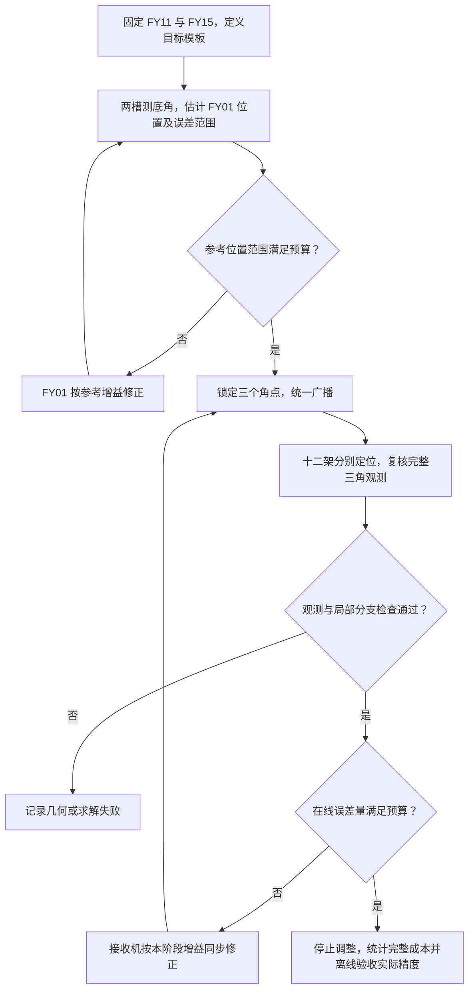

# 第二问方法推导与模型检验

编队调整的完整操作流程与正文图见[第二问解答](../../solutions/q2/README.md)。本文件集中保存局部灵敏度、误差传播、统计预算和协议比较的详细依据；图表与原始数据入口见[资料索引](资料索引.md)。

第二问给出了 15 架无人机的五层等间距三角编队目标，需要设计利用夹角信息完成位置调整的通用策略。与已知准确发射机位置的定位问题相比，首先要解决的是公共参考从哪里来：初始各机都可能有偏差，直接把三架的目标坐标当成真实坐标，会把参考偏差传给所有接收机。

这里采用的方案是：固定底边两端作为编队坐标基准，先用两个底角确定并校准顶点 FY01，再让三个角点同时发射，其余 12 架分别定位、并行调整。校准精度由最终位置误差预算决定；参考建立和接收机调整分别使用增益 $\eta_C$、$\eta_R$。最终评价关注编队是否进入给定的位置误差范围，以及为此用了多少测角槽、发射机次和累计位移。

这份说明连接几何模型、局部反演、误差传播、阈值、增益与通信成本。详细计算分别见[参考残差传播](参考残差传播与校准阈值.md)、[底角区间预算](底角区间与位置预算.md)、[几何边界](几何边界核验.md)、[测角误差与增益](测角误差与增益选择.md)和[调整协议对照](参考建立与调整协议对照.md)。

## 1. 模型的输入、输出与坐标

输入包括每架无人机的编号、目标模板、各静止测角批次的发射机编号及接收到的夹角。在线几何估计不读取仿真真值。输出是每架待调整无人机在规范坐标中的期望位移，以及当前观测是否满足精度与分支检查。

编号按五层排列：FY01；FY02–03；FY04–06；FY07–10；FY11–15。取规范邻间距为 $d=1$，第 $r$ 层、第 $c$ 个槽位的目标为

$$
Q_{r,c}=\left(2-\frac r2+c,\;2\sqrt3-\frac{\sqrt3}2r\right),
\qquad r=0,1,2,3,4,\quad c=0,\ldots,r.
$$

固定 FY11、FY15 的当前位置，定义规范坐标 $A=(0,0)$、$B=(4,0)$；目标顶点为 $C_0=Q_1=(2,2\sqrt3)$。规范化吸收了全队的平移、旋转和正尺度。若实际固定底边长度为 $L_{AB}$，则最终实际邻间距为 $d_{\mathrm{actual}}=L_{AB}/4$。题面中的 $50\,\mathrm m$ 可用于展示尺度，纯角度不能独立测出米制长度。

初始状态位于编号模板的相似副本附近，并保持约定的上侧分支。动作模型假设能在统一规范坐标中准确施加所求位移，忽略运动过程。这个执行能力是建模假设，须与角度定位的信息能力分别说明。

## 2. 两个底角建立公共参考

参考建立的一轮包含两个静止测角槽：FY01/FY15 发射、FY11 接收得到 $\alpha$；FY01/FY11 发射、FY15 接收得到 $\beta$。两个标量需要回传给估计端。由正弦定理，FY01 在上侧分支的位置估计为

$$
\hat C=F(\alpha,\beta)
=\frac{4\sin\beta}{\sin(\alpha+\beta)}
\begin{bmatrix}\cos\alpha\\\sin\alpha\end{bmatrix}.
$$

合法非退化三角形满足 $\alpha>0$、$\beta>0$、$\alpha+\beta<\pi$。得到位置估计后，施加 $\Delta_C=-\eta_C(\hat C-C_0)$，实际状态更新为 $C^+=C+\Delta_C$。下一轮重新测量两底角，直至满足参考位置预算。

无噪声且选中正确分支时 $\hat C=C$，因此 $\eta_C=1$ 一次修正即可到达目标。$\eta_C=0.5$ 每次保留一半位置误差，$\eta_C=0.75$ 每次保留四分之一。它们对应不同修正幅度，模型没有只允许 $0.5$ 和 $1$ 的限制。

## 3. 三个角点同时服务十二架接收机

FY01 达到参考精度后，与 FY11、FY15 一起固定为发射参考。每个主广播槽中三个角点同时发射，其余 12 架各自获取三个带编号夹角。对接收机 $i$，记实际角度映射为

$$
h(p;a,b)=\operatorname{atan2}\left(
|(a-p)\times(b-p)|,\;(a-p)\cdot(b-p)
\right).
$$

观测向量依次使用发射对 $(1,11)$、$(1,15)$、$(11,15)$。在编号模板位置上选两条光滑且独立的角约束，通过二维最小二乘求得 $\hat p_i$，然后使用全部三个夹角复核。初值为已知槽位 $Q_i$，体现了编队调整的局部位置先验。

接收机据此计算 $\Delta_i=-\eta_R(\hat p_i-Q_i)$。全部接收机消费完同一个静止广播后，再同时施加位移；更新必须加到真实当前位置，不能用估计位置直接覆盖真实状态。下一广播槽用于重新定位和验收。

FY12–FY14 位于底边上，其 $(11,15)$ 夹角为 $\pi$。这一行的无向角导数不适合直接放入光滑求解器，但另外两行仍能确定二维局部位置。由此可见，一条角约束退化不等于整个接收机无法定位。

## 4. 灵敏度怎样连接位置与角度

固定 FY11、FY15 后，先确定 FY01 的两个坐标，再分别确定 12 架各自的两个坐标，合计为 $2+12\times2=26$ 个局部未知量。这个计数解释了方法的分解；可辨识性仍取决于所用角度是否提供独立信息。

对于两条选定的角 $H_i(x,y)$，Jacobian 是一张位置—角度灵敏度表：

$$
J_i=
\begin{bmatrix}
\partial H_{i,1}/\partial x&\partial H_{i,1}/\partial y\\
\partial H_{i,2}/\partial x&\partial H_{i,2}/\partial y
\end{bmatrix},\qquad
\Delta H_i\approx J_i\Delta p_i.
$$

秩为 2 表示两个独立的位置方向都能在局部影响观测。最小奇异值 $\sigma_{\min}(J_i)$ 衡量最不敏感的方向：它很小时，即使矩阵仍满秩，一点角度误差也可能对应很大的位置误差。给定角误差向量 $\varepsilon_i$，线性位置扰动为 $J_i^{-1}\varepsilon_i$。

原定位器按目标处未加权的最小奇异值选择光滑角行，用于改善数值条件性。测角精度还取决于角误差协方差；共享方位观测生成的三个夹角存在相关性，应结合 $J_i^{-1}\Sigma_{\theta,i}J_i^{-\mathsf T}$ 评价位置误差，不能只看角度条数。

## 5. 参考误差和接收机误差如何合成

设 FY01 锁定后的实际位置为 $C=C_0+\delta C$。三参考观测来自这个实际位置，而静态主定位器按目标参考位置 $C_0$ 解释角度。记 $B_i=\partial H_i/\partial C$、$G_i=J_i^{-1}B_i$，则在目标附近

$$
\hat p_i-p_i\approx G_i\delta C+J_i^{-1}\varepsilon_i.
$$

两项分别对应公共参考位置偏差和该接收机的测角误差。若记实际位置误差为 $e_i=p_i-Q_i$，动作后有

$$
e_i^+\approx(1-\eta_R)e_i-\eta_RG_i\delta C
-\eta_RJ_i^{-1}\varepsilon_i.
$$

因此固定参考残差造成的一阶终点偏差为 $e_i^*\approx-G_i\delta C$。减小接收机增益会改变到达这个偏置终点的速度，不能将这个固定偏置平均掉。

当前模板中，$\max_i\lVert G_i\rVert_2=1.0408329997$；FY02、FY03、FY07、FY10、FY12、FY14 达到该最大值。FY04、FY06、FY13 的倍率为 $1$，FY05、FY08、FY09 为 $0.7$。这给出参考精度需求的方向性依据：参考误差并没有在目标附近被放大很多倍，但它由多架接收机共同继承，必须纳入全队预算。

## 6. 用位置预算确定何时锁定 FY01

设允许的最终全队最大位置误差为 $E$，分配给参考传播的预算为 $E_C$，给接收机定位与停止的预算为 $E_R$，其余用于非线性余项及其他明确误差。目标附近的预算关系为

$$
G_{\max}\tau_C+E_R+E_{\mathrm{rem}}\le E,
\qquad \tau_C\le E.
$$

这里 $\tau_C$ 限制实际参考残差，而有限噪声下的估计残差还须加上估计不确定度。以 $E=0.01d$ 为计算情景，若给参考传播分配一半预算，得到一阶建议 $\tau_C\le0.0048038d$。这说明 $0.0048d$ 或相近量级的校准具有预算依据。

在目标处，两底角灵敏度为

$$
J_C=\frac18
\begin{bmatrix}-\sqrt3&1\\\sqrt3&1\end{bmatrix}.
$$

若两底角相对目标的真实偏差各自不超过 $\varepsilon$，一阶位置界为 $8\varepsilon d$。对于有限角度范围，还可使用精确区间方法：两底角的上下界在平面上围成一个凸四边形，最大可能位置偏差等于四顶点中到 $C_0$ 的最大距离。

精确计算表明，FY01 位置预算 $0.0048d$ 对应目标附近每个底角允许约 $0.0343418^\circ$ 的对称偏差，$0.005d$ 对应约 $0.0357711^\circ$。在精确角度情景中，可以直接检查 $\lVert\hat C-C_0\rVert\le\tau_C$；给定观测误差区间时，则检查整个可行位置四边形是否落入半径 $\tau_C$ 的预算圆中。

阈值也可以小于上述示例。选择的关键是它对应什么最终精度，而非把一个数值求解容差当作统一的编队精度要求。

## 7. 增益的速度与误差关系

在准确反演和精确执行的理想模型中，误差递推为 $e_{t+1}=(1-\eta)e_t$，线性收敛范围是 $0<\eta<2$。当 $\eta>1$ 时误差会交替换向；非线性定位仍需要留在所用分支中，所以这个线性范围不能直接解释为整个协议的任意初态保证。当前方案使用 $0<\eta\le1$ 的修正增益，精确情景取 $1$ 有直接依据。

若每轮等效位置噪声 $n_t$ 独立、零均值、协方差为 $R$，且连续执行调整，则 $e_{t+1}=(1-\eta)e_t-\eta n_t$ 的稳态噪声协方差为

$$
S_\infty=\frac{\eta}{2-\eta}R.
$$

增益 $0.25,0.5,0.75,1$ 对应的方差倍率分别为 $1/7,1/3,3/5,1$。较小增益减小独立测量噪声在连续调整中的方差，同时减慢初始误差衰减。有限观测预算 $T$ 下，还必须保留初始误差项：

$$
\mathbb E[e_T]=(1-\eta)^Te_0,
\qquad
\operatorname{Cov}(e_T)=
\frac{\eta}{2-\eta}\bigl[1-(1-\eta)^{2T}\bigr]R.
$$

有固定参考残差时，应先把 $e_T$ 分解成偏置终点附近的瞬态和本轮测角噪声。若参考残差本身来自一次随机校准，锁定之后它仍是整条主阶段轨迹的共同随机常量；它不会按上式的白噪声倍率反复衰减。

因此分别选择 $\eta_C$、$\eta_R$：参考建立关心锁定时的残差与置信范围，主阶段关心给定参考精度后的收敛成本和单机测量误差。在同样的测角预算和初态下比较这些量，才能判断某个中间增益是否合适。

## 8. 停止调整与最终精度的关系

本方法区分四种量，分别用于检查不同问题。

| 量 | 定义与来源 | 用途 |
|---|---|---|
| 定位拟合残差 | 估计位置生成的三角观测与本轮收到的观测之差 | 检查求解是否与观测一致，保留数值或分支失败 |
| 目标角残差 $r_i$ | 本轮观测与理想模板角度之差 | 检查当前方位几何接近目标的程度 |
| 估计位置误差 $\hat e_i$ | $\hat p_i-Q_i$，由角度与模板计算 | 构造在线调整及位置预算停止量 |
| 实际位置误差 $e_i$ | $p_i-Q_i$，在仿真中由真实状态评分 | 验收最终队形精度，不能直接输入在线停止 |

定位拟合残差很小只说明找到了能解释观测的位置。若参考有偏差，估计位置也可能带偏；若几何存在多解，还可能找到其他同观测位置。因此完整三角复核是必要的实现检查，不能单独承担全队精度保证。

若使用目标角残差停止，选定光滑行的观测满足局部展开

$$
r_i=J_ie_i+B_i\delta C+\varepsilon_i+\mathcal R_i.
$$

其中 $\mathcal R_i$ 是关于位置和参考偏差的非线性余项。解出实际位置误差，

$$
e_i=J_i^{-1}r_i-G_i\delta C-J_i^{-1}\varepsilon_i-J_i^{-1}\mathcal R_i.
$$

这说明停止时目标角残差、参考残差、测角误差和局部余项如何共同决定真实位置误差。若每个选定角残差不超过 $\tau_\alpha$，则相应的线性预算可写成

$$
\lVert e_i\rVert_2
\lesssim
\sqrt2\lVert J_i^{-1}\rVert_2\tau_\alpha
+\lVert G_i\rVert_2\tau_C
+\lVert J_i^{-1}\varepsilon_i\rVert_2.
$$

若使用估计位置停止，则相应关系为 $\lVert e_i\rVert\lesssim\lVert\hat e_i\rVert+\lVert G_i\rVert\tau_C+\lVert J_i^{-1}\varepsilon_i\rVert$，同样需要给参考偏差和测量误差留下预算。把 $\lVert\hat e_i\rVert\le E$ 直接解释为 $\lVert e_i\rVert\le E$ 会漏掉这些项。

在精确模型下，可以用有限参考校准加足够小的目标角残差，检查接收机是否到达允许的偏置终点。在含噪模型下，原 $10^{-8}\,\mathrm{rad}$ 的目标角容差远小于本轮噪声情景，不能期待每次观测都达到它。可行的统计设计是预先约定静止采样批次、观测精度和覆盖概率，用有明确置信度的位置集合参与验收；持续反复查看则须另计整体误判概率。

仿真最终统一报告

$$
E_{\max}=\max_{1\le i\le15}\lVert p_i-Q_i\rVert_2,\qquad
E_{\mathrm{RMS}}=\sqrt{\frac1{15}\sum_{i=1}^{15}\lVert p_i-Q_i\rVert_2^2}.
$$

本节坐标已经以邻间距归一化，所以这些数值以 $d$ 为单位。最大误差包括 FY01；固定两底点的规范误差为零。评价以固定底边定义的目标为准，不在评分时重新任意旋转或缩放以消除残差。

## 9. 几何与分支适用范围

参考建立要求两底角对 FY01 位置有足够灵敏度。FY01 从底边内部接近底边时，两个底角之和趋于 $0$；从底边外部接近延长线时，角和趋于 $\pi$。当 FY01 很高或很远时，两条基准视线同样可能缺乏足够的交会角。相应的逆灵敏度随路径恶化，不能把目标点处的系数 $8$ 用于所有构型。

接收机侧需要区分三种情况：一条无向角在 $0$ 或 $\pi$ 处不可微、所选两条角不能稳定约束两个位置方向、全部角度本身存在几何非唯一性。第一种情况可通过选用其余光滑行处理，后两种则需要局部先验和适用域检查。

完整几何非唯一性的直接例子是三参考点的外接圆。固定参考为当前理想大等边三角形，其圆心为 $O=(2,2\sqrt3/3)$、半径为 $4/\sqrt3$。同一开圆弧上的多个位置对三个参考点产生相同的带编号圆周角；沿弧方向移动时观测不变，此时完整角度 Jacobian 只有秩 1。因而即使三个角都远离 $0$ 和 $\pi$，也可能无法唯一定位。

FY01 的上下镜像则给出相同的两个底角，所以本方法还使用上侧分支约定。各接收机从编号槽位启动求解，也是可辨识性合同的一部分。有限扰动和多初值实验用于检查这个合同中的具体点与路径，不把成功比例扩写成未检验区域的保证。

## 10. 完整协议与成本核算

一次参考观测用两个槽，每槽两架发射，并回传两个底角标量；一次主广播用一个槽、三架发射，十二架共享它。设参考阶段完成 $n_C$ 轮观测，主阶段完成 $n_R$ 次广播，包含移动后复测，则

$$
N_{\mathrm{slot}}=2n_C+n_R,\qquad
N_{\mathrm{tx}}=4n_C+3n_R,\qquad
N_{\mathrm{relay}}=2n_C.
$$

累计位移为 $D_{\mathrm{total}}=\sum_t\sum_i\lVert\Delta_i^{(t)}\rVert_2$，表示各次状态端点之间的欧氏位移总和。模型忽略调整时间，未由此计算真实飞行轨迹、能量或电磁暴露概率。全队停止状态的汇总也需要协议支持，不能因共享一个测角槽而视为所有通信免费。

算法可以按下图执行。观测期间保持同一静止状态，执行动作后用新观测确认。



在精确局部模型的单位增益非理想初态中，FY01 一次移动及复测用四槽，接收机一次移动及复测用两槽，合计六槽、十四发射机次。这个成本来自协议结构、单位增益和精确反演共同作用，不能将数值误差接近机器精度单独当作鲁棒性证据。

## 11. 同步和重叠调整的适用条件

两底角除了判断 FY01 是否到达目标，也提供其当前规范位置。因此可以构造同步对照：一轮内先保持全队静止，两槽反演当前 $\hat C_t$，再做一次三参考广播；接收机以 $[\hat C_t,A,B]$ 作为已知参考求解。所有估计完成后，FY01 与接收机再一起动作。

这种方法把参考尚未到目标的偏差与参考位置估计误差区分开来。在精确测角和正确局部分支中，$\hat C_t=C_t$，接收机便可使用当前三角形定位，即使参考顶点还在调整。但它要求接收机获得同一静止批次的当前参考坐标，三槽之间不能移动，也不能把动作前的旧参考坐标用于动作后的观测。

同步每轮需要三槽、七发射机次，并需要两个底角回传及将当前参考坐标或等价的两个角度标量共享给接收机。标量载荷与物理传输槽分别计数；未指定链路实现时，不能把额外信息量虚构成已知的无线能耗或免费通信。

在单位增益精确模型中，同步方案仍需一轮测角动作和一轮复核，共六槽、十四发射机次，与两阶段一致。其他增益下，它可能节省等待参考完成的轮次，也可能因为接收机每轮都要额外支付两底角测量而增加成本。因此选择要以相同精度预算下的完整结果为依据。

两个阈值 $\tau_{\mathrm{start}}>\tau_{\mathrm{lock}}$ 可描述重叠方案：先单独校准 FY01，进入较宽邻域后启动接收机粗调，达到较小阈值后锁定参考并做精调。若粗调时仍使用目标参考 $C_0$，它继承当时较大的参考偏差；若使用当前 $\hat C_t$，则需要同步方案的时序与信息共享。

对每轮重新估计参考的重叠实现，设单独建立阶段为 $n_{\mathrm{pre}}$ 轮、重叠阶段为 $n_{\mathrm{overlap}}$ 轮、锁定后主阶段为 $n_{\mathrm{post}}$ 槽，则

$$
N_{\mathrm{slot}}=2n_{\mathrm{pre}}+3n_{\mathrm{overlap}}+n_{\mathrm{post}},\qquad
N_{\mathrm{tx}}=4n_{\mathrm{pre}}+7n_{\mathrm{overlap}}+3n_{\mathrm{post}}.
$$

重叠只有在减少的锁定后广播代价足以抵消重叠广播和附加信息成本时才有价值。在精确单位增益下，参考本来就只有一次校正，没有可持续利用的粗调窗口；在含噪下，还需同时管理当前参考估计的不确定度。当前主方案采用两阶段，把公共参考误差控制和接收机调整分开；同步对照用于说明什么条件下重叠可能值得采用。

## 12. 实验怎样支持参数设计

第二问没有给定一张初始坐标表，实验因此采用明确生成规则下的固定初态，并把不同验证放在各自能支持的结论范围内。

### 精确模型下的基础闭环与有限阈值

原基础批次使用理想初态及四档扰动、每档三个固定种子，共 13 个初态，分别运行增益 $1$ 和 $0.5$，26/26 通过在线角度停止及离线 $10^{-6}d$ 位置标准。单位增益的 12 个非理想初态全部为六槽、十四发射机次；这验证了精确模型中的反演、动作和复测流程。

有限校准对照固定 $\rho=0.1$、种子 11/23/47，比较增益 $1,0.8,0.5$ 与原角度规则、$0.005d$、$0.01d$ 位置校准规则，共 27 个完整协议。所有案例在线停止且满足作为示例的 $0.01d$ 位置目标，其中 12 例未满足原有 $10^{-6}d$ 标准，失败记录按原精度要求保留。

例如增益 $0.5$ 时，参考阈值 $0.005d$ 把完整槽数从 69–73 降为 35–40，发射机次从 163–171 降为 95–106，最终全队最大误差范围为 $0.0027901d$–$0.0049548d$。这给出了精度与成本的实际交换；它的含义依赖最终允许的位置误差。

### 最坏传播方向与几何反例

目标处 $G_{\max}$ 的右奇异向量代表参考偏差的一阶最坏方向。沿其正负方向保留 FY01 残差后，$0.0048d$、$0.005d$、$0.01d$ 的主阶段终点误差分别约为 $0.004996d$、$0.005204d$、$0.010408d$。所以把参考误差也设成全队允许的 $0.01d$，即使主阶段将目标角误差压得很小，仍有超标反例。

上述终点数据来自 30 个完整主阶段：三档参考残差、最坏方向正负两侧，以及对全部 12 架同时施加的五种初始偏移（零、横向或纵向 $0.05d$、横向或纵向 $0.1d$）。前两档均使用四次主广播，最后一档使用四至五次；这些成本不含参考建立。另有 600 次局部估计与几何路径记录，说明候选阈值在所测附近接收机偏差下仍有余量。外接圆同观测反例建立了全局唯一性主张的明确边界，局部测试不会将它消除。

### 有噪声时四档增益的同预算比较

测角噪声情景明确设置为 $0.01^\circ,0.05^\circ,0.1^\circ$。参考两底角每轮独立加高斯误差；主阶段先在三条方位上加独立高斯误差，再生成三条无向夹角，这使共享同一方位的夹角具有正确的相关性，并保留 $0/\pi$ 折叠。

局部线性系统每组使用 8000 条随机输入轨迹，比较四档增益，12 个组合的接收机 RMS 模拟值与解析预测最大相对差约为 $0.276\%$。这个验证针对所写出的线性随机模型。

非线性角度观测与原定位器另运行 24 条固定轨迹：每个噪声水平两个固定输入，同一输入分别运行 $\eta_C=\eta_R=0.25,0.5,0.75,1$。每条均使用八轮参考调整和十八轮主调整，共 34 测角槽、86 发射机次；这些是固定预算末端结果，未模拟完成在线统计锁定与最终置信验收。

下面以 $0.05^\circ$ 两条固定输入为例，RMS 为两例的全队均方误差合并后开方，最大误差取两例最坏值：

| 增益 $\eta_C=\eta_R$ | 固定预算全队 RMS / $d$ | 样例最大位置误差 / $d$ | 累计位移范围 / $d$ |
|---:|---:|---:|---:|
| 0.25 | 0.0078084 | 0.0119897 | 0.6111–0.6614 |
| 0.50 | 0.0024456 | 0.0053361 | 0.7833–0.7991 |
| 0.75 | 0.0033609 | 0.0075827 | 0.9851–1.0043 |
| 1.00 | 0.0044703 | 0.0103552 | 1.2496–1.3019 |

在这个固定预算下，$0.25$ 的参考修正尚不充分；$1$ 受测量波动影响更大；$0.5$ 的精度折中较好。高噪声 $0.1^\circ$ 下，即使 $0.5$ 的两个样例中也有全队误差超过 $0.01d$ 的结果。因此这里支持的是“按预算和噪声水平选择增益”，不能把某个增益推广成所有噪声与初态的最优值。

### 分别选择参考与接收机增益

48 行有限时域理论表比较三档噪声与 $4\times4$ 个增益组合，使用固定的非零接收机初始偏差；当前表中综合 RMS 最小组合均为 $(\eta_C,\eta_R)=(0.5,0.25)$。为检验线性筛选，另在上述六个固定非线性输入上复核该组合，非线性轨迹总数达到 30。每条仍为 34 槽、86 发射机次，全部 6480 次接收机求解均通过原定位器复核。

| 每角噪声标准差 | $(0.5,0.5)$ 全队 RMS / $d$ | $(0.5,0.25)$ 全队 RMS / $d$ | 后者样例最大误差 / $d$ | 两组合平均累计位移 / $d$ |
|---:|---:|---:|---:|---:|
| $0.01^\circ$ | 0.0003899 | 0.0003409 | 0.0006126 | 0.6144 → 0.5816 |
| $0.05^\circ$ | 0.0024456 | 0.0021647 | 0.0048660 | 0.7912 → 0.6373 |
| $0.10^\circ$ | 0.0050105 | 0.0046216 | 0.0114912 | 1.0234 → 0.7368 |

RMS 仍按同噪声的两例全队均方误差合并。将接收机增益降到 $0.25$ 后，三档的同预算 RMS 和累计位移都下降，支持当前时域下分别选取两个增益。高噪声例的最大误差仍由 FY01 锁定残差决定，两个组合的最大值同为 $0.0114912d$；减小接收机增益不能替代提高参考测量精度。这个条件化候选已完成非线性复核，结果范围限定为当前初态、噪声与固定观测预算。

### 从估计误差到可信的校准检查

以 FY01 预算 $0.0048d$、已知单次底角标准差 $0.05^\circ$ 为例，使用保守的双角 99% 同时区间，若角度均值恰好位于目标，单次预定检查至少需每角 17 个独立样本，才使整个非线性可行位置集合落入预算。这个检查本身需要 34 槽、68 发射机次；若预先计划最多检查 30 次并控制整体误判概率不超过 1%，每次相应的宽度需求变为每角 31 个样本。

这些是一个已明确概率合同下的采样预算计算，实际均值偏离目标时仍可能不通过锁定。它说明独立噪声能通过静止采样减小，代价必须计入协议；原固定预算增益轨迹不包含这项额外置信确认。局部高斯椭圆可给出更紧的近似预算，需与这里的精确角区间几何界区别使用。

### 相同位置预算下的协议成本

正式协议对照固定参考阈值 $0.005d$、接收机估计位置阈值 $0.0045d$，统一离线验收全队最大误差 $0.01d$。三种固定初态与五组阶段增益分别运行静态两阶段、同步当前参考，共 30 例，全部满足实际位置预算。完整成本如下，区间取三个种子的范围。

| $(\eta_C,\eta_R)$ | 两阶段测角槽 / 发射机次 | 同步测角槽 / 发射机次 | 两阶段最大终点误差 / $d$ |
|---|---|---|---:|
| $(1,1)$ | 6 / 14 | 6 / 14 | $1.41\times10^{-13}$ |
| $(1,0.75)$ | 8 / 20 | 12 / 28 | 0.0044224 |
| $(0.75,0.75)$ | 10–12 / 24–28 | 12 / 28 | 0.0068547 |
| $(0.5,0.5)$ | 16–21 / 38–49 | 18–21 / 42–49 | 0.0072686 |
| $(0.5,1)$ | 12–16 / 26–34 | 15–21 / 35–49 | 0.0049548 |

参考传播的一阶上界约为 $0.0052042d$，加接收机预算后约为 $0.0097042d$。预算中预留了 $0.0002d$ 作为非线性余量；这个预留是设计值，30 例实测提供局部支持，尚未构成整个邻域的严格余项上界。

另保存了未给参考误差分配预算的 60 个对照：它们直接使用 $0.01d$ 接收机估计阈值，其中 5 例在线停止后实际全队误差超标。连同 3 个严格角度基线，93 例共同说明停止口径会改变结论。正式表格使用同一预算比较；负例及各例累计位移均保留在[协议数据](../../outputs/q2/protocol_comparison/protocol_comparison.csv)中。

## 13. 参数选择与证据入口

精确测角、模板附近、理想动作的主方案采用两阶段和 $(\eta_C,\eta_R)=(1,1)$：当前非理想样本需要六槽、十四发射机次。若任务要求有限校准，以 $E=0.01d$ 为示例，可使用 $\tau_C=0.005d$、$\tau_R=0.0045d$ 的已测预算组合；若严格分配一半给参考传播，则取 $\tau_C\approx0.0048d$。参数须随指定全队精度换算。

含噪时，参考校准首先需要测量不确定度预算，再选择有限时域增益。参考误差由全队共同继承，接收机自身噪声和收敛速度可以通过独立的 $\eta_R$ 调节。第 12 节的等增益结果与[分阶段增益分析](测角误差与增益选择.md)给出当前噪声与观测预算下的选择依据。固定预算末端精度、单次置信集合以及完整在线统计验收分别报告，不能用其中一个代替其余两项。

同步当前参考在已测共同预算下没有统一的成本优势。重叠方案的判断可以直接写成成本条件：若参考总观测轮数相同，两阶段原主广播为 $n_R$，重叠后的主广播总数为 $n_{\mathrm{overlap}}+n_{\mathrm{post}}$，则节省测角槽需要 $n_{\mathrm{overlap}}+n_{\mathrm{post}}<n_R$；发射机次相应减少三倍的广播数差。若重叠导致额外 $\Delta n_C$ 轮参考观测，则需再抵消 $2\Delta n_C$ 槽、$4\Delta n_C$ 发射机次以及参考共享信息成本。当前精确单位增益没有持续粗调窗口，因此选择结构较简洁的两阶段；重叠在这里得到条件化成本分析，未列作实验获益。

| 需要核对的结论 | 推导与实现 | 原始证据 |
|---|---|---|
| 两底角反演、十二机闭环 | [基础实现](../../scripts/q2/triangle_reference.py)、[运行说明](三角基准调整.md) | [26 例基础批次](../../outputs/q2/triangle_reference/summary.json) |
| 参考传播符号与有限校准 | [残差分析](参考残差传播与校准阈值.md) | [残差与阈值汇总](../../outputs/q2/reference_residual/summary.json) |
| 最坏方向、接收机偏差及同观测反例 | [几何边界](几何边界核验.md) | [几何汇总](../../outputs/q2/geometry_boundaries/summary.json) |
| 精确位置集合与有限次置信检查 | [底角区间预算](底角区间与位置预算.md) | [预算表](../../outputs/q2/calibration_budget/summary.json) |
| 含噪协方差和阶段增益 | [误差与增益](测角误差与增益选择.md) | [噪声轨迹与理论](../../outputs/q2/noise_gain/summary.json) |
| 统一精度的协议成本 | [协议对照](参考建立与调整协议对照.md) | [93 例汇总](../../outputs/q2/protocol_comparison/summary.json) |

第二问代码集中在自包含文件 [q2.py](../../scripts/q2/q2.py)，按几何、闭环及专题分析分区，可单独复制运行。完整接口索引见[代码说明](../../scripts/q2/README.md)。在仓库根目录执行以下命令可分别复现，各命令支持 `--output-dir` 指定保存位置。

```bash
conda run -n agent python scripts/q2/q2.py triangle
conda run -n agent python scripts/q2/q2.py residual
conda run -n agent python scripts/q2/q2.py geometry
conda run -n agent python scripts/q2/q2.py budget
conda run -n agent python scripts/q2/q2.py noise
conda run -n agent python scripts/q2/q2.py protocols
conda run -n agent python scripts/q2/q2.py e0
conda run -n agent python -m pytest -q tests/q2
```

单文件已在隔离目录复现全部七项分析，467 个输出与原模块版一致，见[独立复现核验](../../outputs/q2/standalone/verification.json)。
