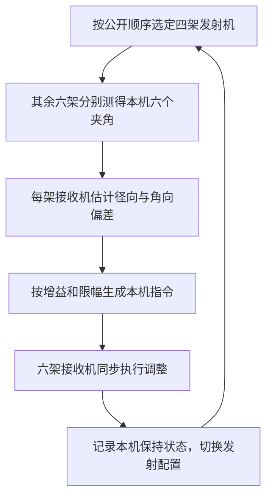
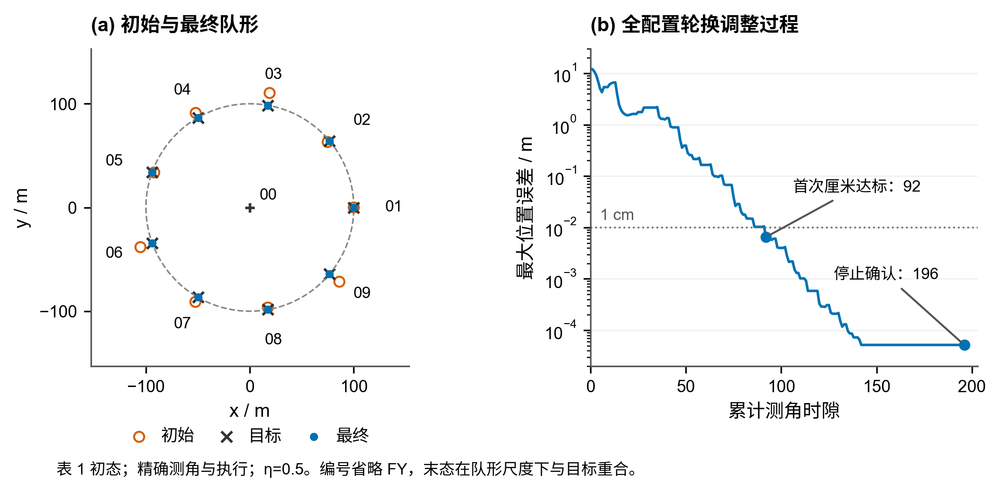
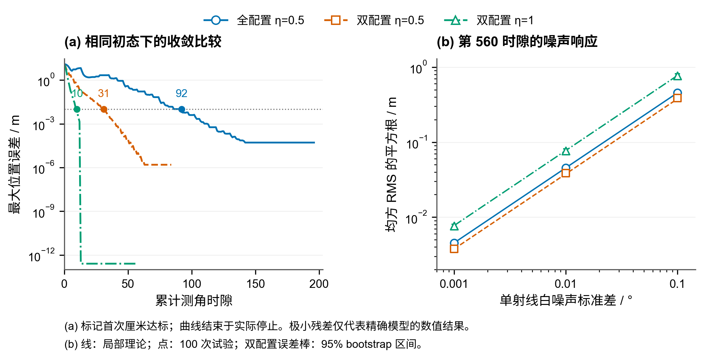

# 问题 1：圆形无人机编队的纯方位定位与调整

圆形编队的三个子问题可以在同一个角度观测模型下求解：1.1 在发射机位置和编号已知时估计接收位置；1.2 把匿名编号作为离散未知量，与接收位置联合辨识；1.3 在辅助发射机也有偏差的情况下，反复估计本机偏差并执行相对修正。三问依次增加了身份不确定性和参考位置不确定性，因此需要分别交代定位解的选择依据、匿名身份的可辨识条件，以及迭代结果的适用范围。

## 统一坐标、符号与观测约定

各无人机保持同一飞行高度，位置问题可在平面中讨论。取 FY00 为原点，FY00 指向 FY01 的理想方向为横轴正向，圆周半径为已知的 $R$。用 $Q_i$ 表示 FY$i$ 的理想位置，$P_i$ 表示实际位置：

$$
Q_0=(0,0),\qquad
Q_i=R\begin{pmatrix}\cos\theta_i^0\\\sin\theta_i^0\end{pmatrix},\qquad
\theta_i^0=\frac{2\pi(i-1)}9,\quad i=1,\ldots,9.
$$

相邻圆周编号的理想角间隔为 $40^\circ$。1.1、1.2 的公式保留一般半径 $R$，数值检查采用 $R=100\,\mathrm{m}$；1.3 按题目要求固定为 $100\,\mathrm{m}$。已知半径提供长度尺度，否则仅凭夹角只能确定相应的归一化几何。

接收机知道自身编号 $k$，从而知道目标位置 $Q_k$。对任意接收位置 $p$ 和两个发射位置 $A,B$，定义无向视线夹角

$$
H(p;A,B)=\arccos\!\left(
\frac{(A-p)^{\mathsf T}(B-p)}{\lVert A-p\rVert\,\lVert B-p\rVert}
\right).
$$

观测只含两条视线之间的夹角，范围为 $[0,\pi]$，不要求接收机测得相对于横轴的绝对方位。各路信号能够区分，因而每个夹角都保留对应的信号配对关系；计算使用弧度，表格可用角度展示。接收机与发射机重合时视线没有定义，必须排除。使用角度导数和等角圆的局部论证还需避开夹角为 $0$ 或 $\pi$ 的共线退化情况。

以下将理想锚点预测简写为 $h_{uv}(p)=H(p;Q_u,Q_v)$。符号 $\binom{A}{2}$ 表示集合 $A$ 中所有无序二元子集；当元素是编号时，它表示所有发射信号配对。

## 1.1 已知编号与准确发射位置下的定位

### 已知条件与核心模型

本问由 FY00 和两架圆周机 FY$i$、FY$j$ 发射，三者位置无偏差，即实际位置等于 $Q_0,Q_i,Q_j$。接收机 FY$k$ 不属于发射集合，实际位置 $p=(x,y)$ 略偏离 $Q_k$。输入为发射编号、半径、自身编号，以及三组带配对关系的实测夹角；未知量为接收机的两个平面坐标。

令 $\mathcal A_{ij}=\{(0,i),(0,j),(i,j)\}$，本问模型归纳为

$$
\left\{
\begin{aligned}
\alpha_{uv,k}^{\mathrm{obs}}&=h_{uv}(p)+\varepsilon_{uv,k},
&& (u,v)\in\mathcal A_{ij},\\
h_{uv}(p)&=\arccos\!\left(
\frac{(Q_u-p)^{\mathsf T}(Q_v-p)}{\lVert Q_u-p\rVert\,\lVert Q_v-p\rVert}
\right),\\
r_{uv,k}(p)&=h_{uv}(p)-\alpha_{uv,k}^{\mathrm{obs}},\\
p_k^*&\in\underset{p\notin\{Q_0,Q_i,Q_j\}}{\operatorname{argmin}}
\sum_{(u,v)\in\mathcal A_{ij}}r_{uv,k}(p)^2,
&& p^{(0)}=Q_k.
\end{aligned}
\right.
$$

这里的最小二乘式给出待求目标，实际算法从 $Q_k$ 出发求局部解，并不声称遍历全平面求得所有全局最优点。精确测角时 $\varepsilon_{uv,k}=0$；存在噪声时，三个角一般无法同时完全拟合。若各对夹角误差相互独立、同方差且服从零均值高斯分布，最小二乘目标对应该误差假设下的最大似然估计。若夹角由同一组方位测量相减得到，误差可能相关，需要相应调整统计模型。

### 求解、解的选择与局部稳定性

角度方程非线性，采用带解析 Jacobian 的非线性最小二乘求解。记 $a=Q_u-p$、$b=Q_v-p$、$\gamma=(a^{\mathsf T}b)/(\lVert a\rVert\lVert b\rVert)$，在非退化位置有

$$
\nabla_p\gamma=-\frac{a+b}{\lVert a\rVert\lVert b\rVert}
+\gamma\left(\frac{a}{\lVert a\rVert^2}+\frac{b}{\lVert b\rVert^2}\right),
\qquad
\nabla_p h_{uv}=-\frac{\nabla_p\gamma}{\sqrt{1-\gamma^2}}.
$$

把三个角的梯度按行排列得到 $J_\alpha$。求解器利用残差和该矩阵更新位置，并输出估计坐标、求解状态、残差范数、奇异值和条件数。局部误差传播满足 $\delta\boldsymbol\alpha\approx J_\alpha\delta p$。当 $\operatorname{rank}(J_\alpha)=2$ 时，附近两个位置方向均可由角度变化区分；最小奇异值 $\sigma_{\min}(J_\alpha)$ 越小，某个方向上的测角扰动越容易被放大为位置误差。

三组无向夹角并不保证全局唯一。不同位置可能给出同一观测，接收机自身编号及“小幅偏差”先验用于选择靠近 $Q_k$ 的物理解。题目未规定偏差的统一米数上限，1.1 的实现据此使用理想位置作初值，没有额外指定固定半径的可行域。对疑似多解情形，可以用多个初值检查候选；小残差说明观测拟合良好，还需结合位置先验判断采用哪一个解。局部 Jacobian 满秩也只支持局部可辨识性。

### 算例与数值依据

取 FY00、FY01、FY05 发射，FY03 接收，$R=100\,\mathrm{m}$。三个发射点为 $(0,0)$、$(100,0)$ 和约 $(-93.969,34.202)\,\mathrm{m}$。借用表 1 的 FY03 接收位置 $(112\,\mathrm{m},80.21^\circ)$ 生成观测，按 FY00–FY01、FY00–FY05、FY01–FY05 排列，得到约 $46.050^\circ$、$46.231^\circ$、$92.282^\circ$。

从 $Q_3\approx(17.365,98.481)\,\mathrm{m}$ 出发，恢复 $p_3^*\approx(19.044,110.369)\,\mathrm{m}$。多起点检查还得到约 $(-13.616,-76.061)\,\mathrm{m}$ 的另一零残差位置；两者到 $Q_3$ 的距离分别约为 $12.01\,\mathrm{m}$ 和 $177.27\,\mathrm{m}$，前者符合本算例的小偏差情形。上述数值经过展示舍入，计算使用完整精度。

已有验证覆盖全部 $\binom92=36$ 组圆周发射机搭配，每组 7 个合法接收机，共 252 个表 1 接收位置案例；发射机始终使用理想坐标。精确观测下全部恢复生成观测的位置。进一步对每对夹角独立加入标准差 $0.1^\circ$ 的高斯扰动，每例运行 200 次，共 50400 次，得到以下条件性统计：

| 两架圆周发射机的较小圆心角间隔 | 位置误差中位数 / m | 位置误差 P95 / m |
|---:|---:|---:|
| $40^\circ$ | 0.49 | 1.41 |
| $80^\circ$ | 0.31 | 0.79 |
| $120^\circ$ | 0.25 | 0.64 |
| $160^\circ$ | 0.23 | 0.59 |

P95 为位置欧氏误差的 95% 分位数。在这些编队位置和噪声条件下，更大的圆心角间隔对应更小的含噪定位误差，与局部奇异值的改善一致。这一结果说明参考几何会影响稳定性，为 1.3 的参考组合评分提供依据；实际传感器精度仍取决于其误差分布与相关性。

## 1.2 匿名发射机的最少数量与身份定位

### 已知条件与联合模型

本问 FY00、FY01 的身份已知，其他信号的编号未知，各发射机仍位于理想位置。接收机知道自身编号 $k\in\{2,\ldots,9\}$、理想位置和半径。先考察只增加一路匿名信号 $U$ 的情形：三路信号可分别识别为 FY00、FY01、$U$，故 $\alpha_{01}$、$\alpha_{0U}$、$\alpha_{1U}$ 的配对明确；待求量为匿名编号 $q$ 和接收位置 $p$。

给定某个 $q$ 后，1.1 已能计算位置。因此，枚举合法编号，并在各编号下保留满足全部精确角度约束的位置，再按自身理想位置筛选。本问核心模型为

$$
\left\{
\begin{aligned}
q&\in\mathcal Q_k=\{2,\ldots,9\}\setminus\{k\},\\
f_q(p)&=\big(h_{01}(p),h_{0q}(p),h_{1q}(p)\big)^{\mathsf T},\\
\boldsymbol\alpha_k^{\mathrm{obs}}
&=\big(\alpha_{01,k}^{\mathrm{obs}},\alpha_{0U,k}^{\mathrm{obs}},
\alpha_{1U,k}^{\mathrm{obs}}\big)^{\mathsf T}=f_q(p),\\
\mathcal C_q&=\{p\notin\{Q_0,Q_1,Q_q\}:f_q(p)=\boldsymbol\alpha_k^{\mathrm{obs}}\},\\
(q^*,p_k^*)&\in\underset{q\in\mathcal Q_k,\;p\in\mathcal C_q}{\operatorname{argmin}}
\lVert p-Q_k\rVert,\\
m_{\min}&=1\qquad\text{（精确测角、已知自身编号与尺度、偏差充分小时）}.
\end{aligned}
\right.
$$

其中 $m_{\min}$ 计数的是 FY00、FY01 之外的额外发射机。数学上的候选集合采用精确相等，程序通过三角残差范数小于 $10^{-8}\,\mathrm{rad}$ 的数值检验实现。距离并列或连续退化分支可能影响最近结果时，程序报告不能唯一确定。

### 额外 0 架为什么不足

仅有 FY00、FY01 时，本机只能得到 $\alpha_{01}$。固定两个端点和一个非退化夹角，接收位置落在通过这两个端点的等角圆弧上。接收机沿自身理想位置附近的同一圆弧作任意小移动，观测保持不变；即使已知自身编号且偏差很小，仍存在一维连续候选。因此额外 0 架无法唯一确定平面位置，至少需要增加 1 架。

### 额外 1 架的自含局部充分性论证

需要同时证明匿名编号能够区分、正确编号下的位置能够确定。

首先固定接收机在 $Q_k$。令 $u_0,u_1$ 为该点指向 $Q_0,Q_1$ 的单位向量。九等分圆周不存在与 $Q_1$ 直径相对的圆周编号，且 $k\ne1$，所以 $u_0,u_1$ 不共线。若匿名方向的单位向量为 $w$，两个观测给出 $u_0^{\mathsf T}w=\cos\alpha_{0U}$ 与 $u_1^{\mathsf T}w=\cos\alpha_{1U}$。这两个线性约束的系数矩阵可逆，因而确定唯一的 $w$。从圆周点 $Q_k$ 沿已确定的射线，与编队圆最多再交于一个其他点，故确定唯一匿名编号。

于是，有限个角度特征 $f_q(Q_k)$ 两两不同，最小间隔

$$
d_k=\min_{q\ne q',\;q,q'\in\mathcal Q_k}
\lVert f_q(Q_k)-f_{q'}(Q_k)\rVert>0.
$$

利用所有 $f_q$ 在 $Q_k$ 附近的连续性，可以选取共同邻域 $B_k$，使每个编号、每个 $p\in B_k$ 都有 $\lVert f_q(p)-f_q(Q_k)\rVert<d_k/3$。对不同编号 $q,q'$ 及邻域内任意 $p,p'$，三角不等式给出 $\lVert f_q(p)-f_{q'}(p')\rVert>d_k/3$。因此不同编号即使采用不同的附近接收位置，也无法产生相同观测。

其次，在正确编号 $q$ 下，$\alpha_{01}$ 与 $\alpha_{0U}$ 分别限定通过 $Q_0,Q_1$ 和通过 $Q_0,Q_q$ 的等角圆弧。在理想接收位置，这两个圆均经过 $Q_k$ 与 $Q_0$，且不可能重合：否则同一个圆将包含三个不同的圆周点 $Q_1,Q_q,Q_k$，故必须等于编队圆，同时又通过圆心 $Q_0$，产生矛盾。两个不同的圆在 $Q_0,Q_k$ 有两个不同交点，故在 $Q_k$ 处横截相交。足够小的扰动保持非退化和局部分支不变，两条约束圆弧附近只有一个合法交点，公共发射点 $Q_0$ 则被排除。

将身份分离与位置唯一性的邻域缩小为以 $Q_k$ 为中心的同一小球，其中只有真实编号和真实位置这一组解。真实位置处于该球内时，比球外任何候选更接近 $Q_k$，因此最近候选规则选中真实解。结合数量下界，可得精确测角且偏差充分小时 $m_{\min}=1$。这个证明给出局部邻域的存在性，没有给出统一的偏差米数上限，也未覆盖任意大偏差或含噪身份辨识。

### 候选的计算与退化处理

每个接收机有 7 个合法匿名编号。对每个编号，先从 $Q_k$ 调用 1.1 的定位求解，再通过等角圆交点补查可能遗漏的解。这样，某一次局部求解失败不会直接被解释为该编号无解。

具体地，将坐标除以 $R$，令 $a_1=Q_1/R$、$a_q=Q_q/R$，以 $\mathcal J(x,y)=(-y,x)$ 表示逆时针旋转 $90^\circ$。对于端点 $0,a$ 和夹角 $\alpha\in(0,\pi)$，两个可能的圆心为

$$
C_s(a,\alpha)=\frac{a+s\cot\alpha\,\mathcal Ja}{2},\qquad s\in\{-1,+1\}.
$$

这些圆经过原点，方程为 $\lVert x\rVert^2-2C_s^{\mathsf T}x=0$。分别用 $\alpha_{01}$、$\alpha_{0U}$ 建圆，得到四组圆心配对 $C=C_s(a_1,\alpha_{01})$、$D=C_t(a_q,\alpha_{0U})$。当 $C\ne D$ 时，两圆相减给出 $(C-D)^{\mathsf T}x=0$；令 $v=\mathcal J(C-D)/\lVert C-D\rVert$，除原点外的候选为 $x=2(C^{\mathsf T}v)v$，乘以 $R$ 恢复实际尺度。

整圆还包含可能对应补角的圆弧，因此每个交点必须重新检验全部三个原始无向角，并剔除发射点、合并重复点。若 $C=D$，约束可能允许连续圆弧。此时保存该整圆到 $Q_k$ 的距离下界 $b=R\left|\lVert Q_k/R-C\rVert-\lVert C\rVert\right|$；只有最佳离散候选严格比所有这类下界更近，才能排除连续分支的影响，否则报告退化。这个检验对连续分支采取保守处理。

### 算例与验证范围

继续使用 1.1 的 FY03 接收算例，将 FY05 的真实编号隐藏，只输入三组夹角、接收机编号和半径。7 个编号都能给出角度一致的位置，距离筛选结果如下：

| 假设匿名编号 | 该编号最近候选到 $Q_3$ 的距离 / m |
|:---|---:|
| FY05 | 12.01 |
| FY06 | 38.24 |
| FY04 | 51.46 |
| FY07 | 77.60 |
| FY02 | 115.95 |
| FY09 | 174.49 |
| FY08 | 206.07 |

算法选择 FY05，输出约 $(19.044,110.369)\,\mathrm{m}$ 的接收位置，与观测真值一致。错误编号也有精确拟合解，说明位置先验在身份筛选中不可省略。

已有验证遍历 8 个接收机与各自 7 个匿名编号：理想接收位置 56 例、表 1 接收位置 56 例，以及径向偏差 $\{-5,0,5\}\,\mathrm{m}$ 与角向偏差 $\{-1,0,1\}^\circ$ 的非零组合共 448 例，合计 560 例。全部编号正确，位置误差均小于 $10^{-6}\,\mathrm{m}$，最大回代误差约为 $1.05\times10^{-9}\,\mathrm{m}$。真实编号和坐标只用于生成观测与事后评价。

这些结果验证了精确几何下的实现；所选扰动点并不构成整个连续区域的保证。额外一架的数量结论由前述局部几何论证支撑，有限案例用于检查枚举、候选补查和选择过程。

## 1.3 四机发射与轮换互校的编队调整

本问需要将表 1 中有偏差的圆形编队调整到半径 $100\,\mathrm{m}$、圆周九机等角间隔的目标队形，每次最多由 FY00 和三架圆周机发射信号。

采用的思路是：每个时隙固定 FY00、FY01 与两架辅助机发射，其余六架根据本机夹角估计径向、角向偏差并同步修正；辅助机轮流成为接收机，使参考位置也得到校正。在全 28 配置轮换的基础上，选出 FY04/FY05 与 FY07/FY08 两组辅助机交替工作。相同增益 $\eta=0.5$ 下，表 1 首次厘米达标由 92 个测角时隙降至 31 个。

### 1.3.1 题目条件与误差表示

取 FY00 为原点，FY00 指向 FY01 的方向为极角零点。圆周机 $i=1,\ldots,9$ 的目标极角为 $\theta_i^0=2\pi(i-1)/9$，目标半径为 $R=100\,\mathrm{m}$。目标位置与实际位置分别写为

$$
Q_i=R\begin{pmatrix}\cos\theta_i^0\\\sin\theta_i^0\end{pmatrix},
\qquad
P_i=(R+\delta r_i)\begin{pmatrix}\cos(\theta_i^0+\delta\theta_i)\\\sin(\theta_i^0+\delta\theta_i)\end{pmatrix}.
$$

表 1 的 FY00、FY01 已处于指定位置，本模型将二者固定为已标定基准。待调整的是 FY02—FY09，目标是逐步减小各机的径向偏差 $\delta r_i$ 和角向偏差 $\delta\theta_i$。求解时使用 $e_i=(\delta r_i,R\delta\theta_i)^{\mathsf T}$，使两个分量都以米计。

每架接收机已知自身编号、发射编号、理想队形、目标半径和公开发射顺序。测量输入为本机接收到的信号夹角。辅助发射机的实际位置有偏差，定位计算仍使用它们的理想位置，因此一次估计也会受到参考误差影响，这正是需要轮换互校的原因。

已知半径提供长度尺度。执行模型假设无人机能以 FY00 来向建立局部径向，并按统一旋转正方向执行相对径向、角向指令。表 1 主实验采用精确测角和精确执行；真实坐标仅供仿真器生成观测、执行命令和事后评分，控制器依据本机观测作决策。

### 1.3.2 一个时隙怎样完成调整

若当前辅助对为 $(a,b)$，则发射集合为 $T_t=\{0,1,a,b\}$，四架发射机保持位置。其余六架各自完成测角与计算，随后同步执行调整。这整个过程计为一个测角时隙，使用四个发射机次。

#### 由夹角估计本机偏差

沿用 1.1 的角度观测函数，对候选位置 $p$ 和理想参考位置 $Q_u,Q_v$ 定义 $h_{uv}(p)=\arccos\big((Q_u-p)^{\mathsf T}(Q_v-p)/(\lVert Q_u-p\rVert\lVert Q_v-p\rVert)\big)$。

四路信号提供六组无向夹角。接收机从三个圆周发射机中选两个，与 FY00 组成一组定位参考；共有三组候选。对每个候选圆周参考对 $S\subset\{1,a,b\}$，用米尺度偏差 $z=(z_r,z_t)$ 求解

$$
\begin{aligned}
p_i(z)&=(R+z_r)\begin{pmatrix}\cos(\theta_i^0+z_t/R)\\\sin(\theta_i^0+z_t/R)\end{pmatrix},\\
z^*_{i,S}&\in\underset{z}{\operatorname{argmin}}
\sum_{\{u,v\}\in\binom{\{0\}\cup S}{2}}
\left[h_{uv}(p_i(z))-\alpha^{\mathrm{obs}}_{uv,i}\right]^2.
\end{aligned}
$$

这里 $\binom{\{0\}\cup S}{2}$ 表示该组三架参考机的所有信号配对。求解从零偏差开始；径向 $\pm80\,\mathrm{m}$、角向 $\pm60^\circ$ 的边界用于数值保护。保留求解成功、拟合残差范数小于 $10^{-8}\,\mathrm{rad}$ 且未触边的候选。

第四架发射机参与六角一致性检查。记候选的六角残差范数为 $c_{i,S}$，理想位置处定位 Jacobian 的最小奇异值为 $\sigma_{i,S}$，按评分 $\sigma_{i,S}/(1+c_{i,S}/s)$ 选出最大者，其中 $s=10^{-3}\,\mathrm{rad}$，同分按编号排序。该规则同时考虑参考几何和实测角度一致性；所有候选均无效时，记录拟合失败并结束该条运行。

选定候选后得到 $\widehat{\delta r_i}=z_r^*$、$\widehat{\delta\theta_i}=z_t^*/R$。参考机也有误差，因而这两个量是反馈使用的本机偏差估计。

#### 同步反馈与默认参数

对两个分量同时进行负反馈，并分别限幅：

$$
\begin{aligned}
\Delta r_i&=\operatorname{clip}(-\eta\widehat{\delta r_i},-d_r,d_r),&
r_i^{t+1}&=r_i^t+\Delta r_i,\\
\Delta\theta_i&=\operatorname{clip}(-\eta\widehat{\delta\theta_i},-d_\theta,d_\theta),&
\theta_i^{t+1}&=\theta_i^t+\Delta\theta_i.
\end{aligned}
$$

默认取 $\eta=0.5$、$d_r=5\,\mathrm{m}$、$d_\theta=2^\circ$。增益 $0<\eta\le1$ 连续可调，本文以 $0.5$ 和 $1$ 作为代表性设置：在 $0.001^\circ$ 白测角噪声、固定 560 时隙预算的已有试验中，$0.5$ 的厘米级末端达标比例更高，因此作为默认值，$1$ 用于快速调整对照。所有接收机使用该时隙执行前的观测，各自计算指令后统一更新位置。选择这些参数的依据见后面的表 1 比较和随机测角误差检验。

接近目标后，程序依据本机估计和六角残差进入保持。具体地，令 $\chi_i=\max\big(|\widehat{\delta r_i}|/(10^{-3}\,\mathrm{m}),|\widehat{\delta\theta_i}|/(10^{-5}\,\mathrm{rad}),c_{i,S}/(10^{-5}\,\mathrm{rad})\big)$。连续 21 次自身接收满足 $\chi_i\le0.5$ 时置零指令；保持期间若 $\chi_i>1$，恢复调整并清零计数。发射时计数保留。仿真在一个与调度对齐的完整周期中所有接收决策均保持时记录协议结束，统一预算为 560 时隙。该结束记录是本机状态的仿真汇总；精度达标时刻由真实误差另行评价。

### 1.3.3 从全配置轮换到双配置互校

#### 全 28 配置作为基础方案

在 FY02—FY09 中枚举所有无序辅助对，共 $\binom82=28$ 个，按编号字典序循环。每架待调机一周期发射 7 次、接收 21 次，因此所有辅助机都会获得调整机会。这个方案给出完整的互校基线。

一次固定配置中，辅助发射机始终不能移动；轮换后它们成为接收机，才能修正自身位置。轮换将“有偏参考帮助别人定位”和“参考机自身被修正”连接起来。参考误差如何随反馈传播，在第 5 节给出局部解释。

#### 两配置的角色分工

将周期缩短为以下两个时隙，之后重复：

| 时隙 | 发射并保持位置 | 接收并按本机状态调整 |
|---|---|---|
| 奇数 | FY00、FY01、FY04、FY05 | FY02、FY03、FY06、FY07、FY08、FY09 |
| 偶数 | FY00、FY01、FY07、FY08 | FY02、FY03、FY04、FY05、FY06、FY09 |

FY04、FY05、FY07、FY08 构成交替互校的参考核心，其余四架每个时隙都接收。两种调度使用相同的本机估计、增益、限幅和连续 21 次保持计数；完整周期确认窗口分别为 28 时隙和 2 时隙。

#### 为什么选 FY04/FY05 与 FY07/FY08

已有筛选分成两步。首先从 28 个辅助对中枚举互不重叠的两对，共 $\binom84\times3=210$ 组；不重叠保证每架辅助机至少在一个相位接收。按理想队形附近的周期谱半径及矩阵幂范数排序，取前三组。随后对这三组的正、反发射顺序，共做 6 条表 1 轨迹比较。

在无拟合失败、首次厘米达标后保持达标的候选中，优先选择首次达标时隙较少者，再以达标时的累计端点位移打破并列。FY04/FY05 → FY07/FY08 与 FY04/FY05 → FY07/FY09 都在第 31 时隙达到厘米精度，前者达标前累计位移为 $64.781\,\mathrm{m}$，后者为 $72.562\,\mathrm{m}$，因此选用前者。反向执行 FY07/FY08 → FY04/FY05 则需 37 时隙。

这是基于局部筛选和表 1 有限轨迹形成的方案。210 组中只对前三组做了上述非线性轨迹比较，结论范围限于这次筛选，未确立全体调度的全局最优性。完整排序规则与六条结果见[双配置选择依据](../../docs/q1_3/双配置选择依据.md)。

### 1.3.4 表 1 的调整结果与代价

以圆周九机的最大位置误差 $E_{\max}(t)=\max_{1\le i\le9}\lVert P_i(t)-Q_i\rVert_2$ 评价队形，首次达标时隙记为 $T_\varepsilon=\min\{t:E_{\max}(t)<\varepsilon\}$。未在记录内达到阈值时记为未达标。该指标使用仿真真值作离线评价。

表 1 初始最大误差为 $12.0111\,\mathrm{m}$。精确测角与执行条件下，各方案结果如下；位移统计到各自完整运行结束。

| 方案 | 首次低于 2 cm / 时隙 | 首次低于 1 cm / 时隙 | 首次低于 1 mm / 时隙 | 完整停止 / 时隙 | 累计端点位移 / m |
|---|---:|---:|---:|---:|---:|
| 全配置，$\eta=0.5$ | 80 | 92 | 113 | 196 | 254.234 |
| 双配置，$\eta=0.5$ | 27 | 31 | 41 | 84 | 64.839 |
| 双配置，$\eta=1$ | 9 | 10 | 13 | 56 | 69.118 |

相同增益 $0.5$ 下，双配置首次厘米达标的时隙和发射机次均减少约 $66.3\%$，完整运行的累计端点位移减少约 $74.5\%$。三项精度门槛在上述轨迹首次达到后均保持达标。

全配置与双配置默认运行的终态最大误差分别约为 $0.0518\,\mathrm{mm}$ 和 $0.001562\,\mathrm{mm}$。完整停止的时隙包含保持确认开销：全配置最后一次移动为第 145 时隙，双配置为第 82 时隙。因此比较调整速度以 $T_\varepsilon$ 为主，完整停止单独列出。累计端点位移是各时隙前后位置差的长度之和，用作移动代价指标；它不包含飞行动力学或能耗模型。

图 1 展示基础方案的初始、目标和终态队形，以及误差随累计时隙的变化。三种设置的收敛曲线见图 2 左侧。原始轨迹与参数比较分别见[全配置结果](../../outputs/q1_3/main_analysis/table1_evaluation.csv)和[双配置结果](../../outputs/q1_3/two_configuration_analysis/table1_evaluation.csv)。

### 1.3.5 模型检验与参数选择

#### 局部收敛依据

在理想队形附近，将八架待调机的误差堆叠为 $e=(e_2^{\mathsf T},\ldots,e_9^{\mathsf T})^{\mathsf T}$。本机估计可展开为 $\widehat e_i=e_i+\sum_j B_{ij}e_j+O(\lVert e\rVert^2)$，其中 $B_{ij}$ 表示辅助参考误差对本机估计的影响。代入负反馈得到 $e_i^+=(1-\eta)e_i-\eta\sum_j B_{ij}e_j+O(\lVert e\rVert^2)$，发射机的误差在该时隙保持不变。

记同步时隙矩阵为 $M_t$，周期长度为 $L$，则一周期满足 $e^{t+L}=Ae^t+O(\lVert e^t\rVert^2)$，其中 $A=M_L\cdots M_1$。默认增益下，全配置的 $\rho(A)\approx0.079220$，双配置的 $\rho(A)\approx0.500022$，均小于 1，支持持续反馈核心的局部稳定性。两者周期长度不同，调度快慢应通过累计时隙结果比较。

该线性化要求参考分支固定、局部定位解连续、未触发限幅，并暂不包含保持记忆。它解释目标附近的误差衰减；表 1 和随机初态下完整算法的表现由实际轨迹检验。参考误差矩阵、两周期收缩和差分核对见[全配置局部分析](../../docs/q1_3/main局部收敛与评价.md)与[双配置局部分析](../../docs/q1_3/双配置轮换互校分析.md)。

#### 随机初态与测角、执行误差

对 FY02—FY09 独立抽取径向偏差 $\delta r\sim\mathrm{Uniform}[-12,12]\,\mathrm{m}$、角向偏差 $\delta\theta\sim\mathrm{Uniform}[-0.3^\circ,0.3^\circ]$，FY00、FY01 固定。该分布用于仿真评价。每个条件使用共同的 100 组随机初态，每条运行最多 560 时隙；表 1 单例另行统计。

白测角噪声在每条接收机—发射机射线方向上独立注入零均值高斯扰动，并逐时隙重新抽样。白噪声行的角度为单射线方向噪声标准差；共享射线的夹角误差相关。相对执行误差为每个活动命令轴独立的零均值高斯乘性扰动，标准差 $1\%$。固定偏置则按链路在每次运行开始时从零均值高斯分布抽样，并在整条运行中保持不变；表中 $0.001^\circ$ 是每条链路跨运行抽样的偏置标准差。

| 条件 | 统计量 | 全配置 $\eta=0.5$ | 双配置 $\eta=0.5$ | 双配置 $\eta=1$ |
|---|---|---:|---:|---:|
| 精确条件 | 首次厘米达标 / 时隙（中位数） | 98 | 38 | 11 |
| 精确条件 | 完整停止 / 时隙（中位数） | 196 | 90 | 56 |
| 白噪声 0.001° | 终点最大误差 / cm（中位数） | 0.72 | 0.614 | 1.24 |
| 白噪声 0.001° | 终点厘米达标数 / 100 | 78 | 99 | 27 |
| 白噪声 0.01° | 终点最大误差 / cm（中位数） | 7.28 | 6.2 | 12.3 |
| 白噪声 0.1° | 终点最大误差 / cm（中位数） | 72.4 | 61.9 | 124 |
| 相对执行误差 1% | 厘米达标且停止数 / 100 | 100 | 100 | 100 |
| 固定偏置 0.001° | 终点最大误差 / cm（中位数） | — | 1.18 | 1.28 |
| 固定偏置 0.001° | 终点厘米达标数 / 100 | — | 38 | 30 |

首次达标时隙和误差使用样本中位数；达标数、停止数均以全体 100 条随机记录为分母。精确条件下，三种设置均为 100/100 终点厘米达标并完成停止。白噪声及固定偏置条件下，所有运行均未在 560 时隙内完成协议停止，表中误差和达标数评价的是预算终点的精度。

同增益比较中，双配置将精确随机初态的首次厘米时隙中位数从 98 降到 38；小白噪声下，终点厘米达标数从 78/100 提高到 99/100。双配置增益提高到 1 后，精确条件收敛更快，但小白噪声的终点厘米达标数降到 27/100。因此本题的默认比较与方案说明采用 $\eta=0.5$，并保留 $\eta=1$ 作为速度与误差放大的参数对照。

当白噪声增至 $0.01^\circ$ 或 $0.1^\circ$，三种设置的终点厘米达标数均为零。固定偏置下双配置的终点厘米达标数为 38/100 和 30/100；这组实验没有全配置同条件对照。单独 $1\%$ 相对执行误差下三种设置均能达标并停止，此处误差随指令缩小，其结论限于该执行模型。

图 2 左侧是表 1 的三条完整收敛曲线，各自在实际结束处终止；右侧比较第 560 时隙的理论和经验误差量级，统计量为 $\sqrt{\operatorname{mean}(\mathrm{RMS}^2)}$，其中单条轨迹的 $\mathrm{RMS}=\sqrt{\sum_{i=1}^9\lVert P_i-Q_i\rVert^2/9}$，含误差为零的 FY01。它与表中“最大位置误差的中位数”分别统计。双配置误差棒采用已有的逐次试验 bootstrap 95% 区间，全配置展示现成点值。

详细的随机初态矩传播、白噪声稳态、固定偏置和执行误差推导分别见[随机初态矩分析](../../docs/q1_3/双配置轮换随机初态矩分析.md)与[含噪数学模型](../../docs/q1_3/双配置轮换含噪数学模型.md)，完整样本统计见[随机与含噪验证](../../docs/q1_3/双配置轮换随机与含噪验证.md)。

### 1.3.6 论文图表与计算来源

正文中的调整公式对应[本机控制器](../../scripts/q1_3/local_adjustment.py)，配置来源见[双配置选择依据](../../docs/q1_3/双配置选择依据.md)。表 1 逐时隙轨迹、终态位置、参数实验、论文图片和完整检验数据统一列在[资料索引](../../docs/q1_3/资料索引.md)，运行命令见[代码入口](../../scripts/q1_3/README.md)。

本问结果建立在已知尺度、固定已标定 FY00/FY01、指定相对运动接口和所列测量条件下。论文中应将表 1 的具体方案、随机实验的样本结果以及持续反馈的局部理论按各自条件表述。

## 证据与实现来源

1.1 的精确与含噪统计见[定位验证记录](../../docs/q1_1/验证记录.md)，1.2 的候选补查、退化诊断和 560 例检查见[匿名辨识验证记录](../../docs/q1_2/验证记录.md)。1.3 的本机算法与执行假设见[迭代验证记录](../../docs/q1_3/验证记录.md)、[本机控制实现](../../scripts/q1_3/local_adjustment.py)及[仿真实现](../../scripts/q1_3/run_adjustment.py)。累计时隙结果可由[汇总](../../outputs/q1_3/summary.json)、[逐时隙误差](../../outputs/q1_3/error_history.csv)、[本机动作](../../outputs/q1_3/adjustment_steps.csv)和[公开发射表](../../outputs/q1_3/transmitter_schedule.csv)核对。

1.3 的全配置与双配置推导、随机含噪实验和历史材料统一见[资料索引](../../docs/q1_3/资料索引.md)，运行与出图见[代码入口](../../scripts/q1_3/README.md)。本节由[独立正文](../q1_3/README.md)通过 `scripts/q1_3/sync_solution.py` 同步。
