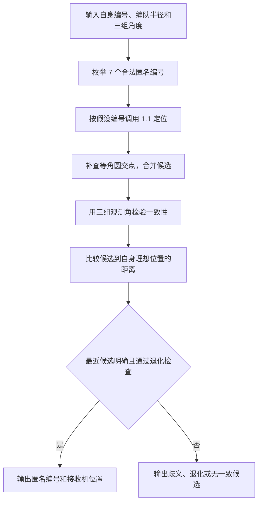

# 问题 1（2）解答：有限编号枚举与几何一致性筛选

在接收机知道自身编号、FY00 与 FY01 的信号能够区分、编队半径已知且接收机偏差充分小的条件下，**除 FY00 和 FY01 外，再增加 1 架编号未知的发射机即可有效定位**。方法是枚举匿名编号，复用问题 1（1）的角度模型，再用接近自身理想位置的条件选择身份和位置。

这次实现沿用 [问题 1（1）](../q1_1/README.md) 的点积角度约束和局部最小二乘，新增的工作集中在身份枚举、候选补查与筛选。

## 1. 已知条件、输入和输出

令 FY00 为原点，FY01 方向为横轴，圆周半径为 $R$。圆周上编号为 $i$ 的无人机理想位置为 $P_i^0=R(\cos\theta_i,\sin\theta_i)$，其中 $\theta_i=40^\circ(i-1)$。

接收机编号 $k\in\{2,\ldots,9\}$ 已知，实际位置 $P$ 未知；匿名发射机的编号记作 $q$。由于 FY00、FY01 已知，接收机本身不能同时作为本次发射机，合法候选集为 $\mathcal Q_k=\{2,\ldots,9\}\setminus\{k\}$，恰有 7 个编号。

| 项目 | 本问使用的信息 |
|---|---|
| 已知几何 | 编队半径 $R$、各编号的理想位置；所有发射机位置无偏差 |
| 接收机先验 | 知道自身编号 $k$，实际位置接近 $P_k^0$ |
| 观测输入 | 有序的三组无向夹角 $(\alpha_{01},\alpha_{0U},\alpha_{1U})$，代码单位为弧度 |
| 需要识别 | 匿名发射机编号 $q$ 与接收机实际位置 $P$ |
| 输出诊断 | 每个编号下的候选坐标、角度残差、距理想位置的距离，以及歧义或退化状态 |

匿名信号 $U$ 能与 FY00、FY01 的信号分开，但不知道对应哪架无人机。三组角度保留这层对应关系，不对角度排序。半径取 $100\,\mathrm{m}$ 仅用于数值验证；模型保留一般的已知 $R$。如果半径也未知，仅凭夹角不能恢复绝对尺度。

## 2. 为什么额外 0 架不够

只有 FY00 和 FY01 发射时，观测只有 $\angle P_0PP_1=\alpha_{01}$。固定两个端点和一个非退化夹角，接收机可位于相应的等角圆弧上。在其理想位置的任意小邻域内，仍有一段圆弧产生同样的观测。因此，知道自身编号和“小幅偏差”仍不足以把位置缩成一个点，额外发射机数量满足 $m\geq1$。

## 3. 增加 1 架后的算法

### 3.1 每个编号都代入问题 1（1）

对每个 $q\in\mathcal Q_k$，发射机坐标暂定为 $P_0$、$P_1$、$P_q^0$。保持观测顺序，计算预测角度向量

$$
F_q(P)=
\begin{pmatrix}
\angle P_0PP_1\\
\angle P_0PP_q^0\\
\angle P_1PP_q^0
\end{pmatrix},\qquad
E_q(P)=\left\lVert F_q(P)-\boldsymbol\alpha^{\mathrm{obs}}\right\rVert_2^2.
$$

夹角通过问题 1（1）的归一化点积和反余弦计算。对每个编号，以 $P_k^0$ 为初值调用 `localize_receiver()`，得到局部候选位置和角度残差。

### 3.2 补查候选，再比较距离

一个编号下可能存在多个零残差位置；局部求解器也可能收敛到非零残差点，或在迭代中遇到退化夹角。因此，程序对每个编号同时做一个有限的等角圆交点补查。补查仍使用同一组角度方程，具体计算放在 [验证记录](../../docs/q1_2/验证记录.md) 中。

对补查与局部求解产生的候选，重新检验全部三组角度，只保留残差范数不超过数值容差 $\varepsilon_\alpha$ 的位置。记其集合为 $\mathcal C_q$。在非退化的有限候选中，选择

$$
(q^*,P^*)=
\underset{q\in\mathcal Q_k,\;P\in\mathcal C_q}{\operatorname{argmin}}
\left\lVert P-P_k^0\right\rVert_2.
$$

这里使用的是“实际位置接近自身理想位置”的先验。程序没有人为设置最大偏差米数。若最近两个不同位置在数值容差内并列，就返回歧义；若存在可能更近的连续解分支，就返回退化状态，不强行确定身份。

默认角度残差容差为 $10^{-8}\,\mathrm{rad}$；距离并列容差为 $10^{-7}R$，当 $R=100\,\mathrm{m}$ 时为 $10^{-5}\,\mathrm{m}$。它们服务于浮点数计算，不代表测角误差模型或飞行偏差上限。

因此，本问的主算法可以命名为**基于有限枚举与几何一致性筛选的匿名发射机辨识**。离散部分只有 7 个身份假设；每个假设的圆交点补查只有 4 组符号组合。

## 4. 为什么充分小偏差下 1 架足够

下面的论证针对精确角度观测，说明“小幅偏差”在身份和位置两个层面上的作用。

### 4.1 在理想接收位置，不同匿名编号具有不同角度特征

先固定接收机的理想位置 $P_k^0$。从这里指向 FY00 和 FY01 的单位向量记为 $u_0$、$u_1$，指向匿名发射机的单位向量为 $u_q$。

由于 9 架圆周无人机没有与 FY01 径向相对的圆周编号，$P_k^0$、FY00 和 FY01 不共线，所以 $u_0$、$u_1$ 线性无关。若两个候选编号给出同样的三组角度，那么它们的匿名方向都满足

$$
\begin{pmatrix}
u_0^\mathsf T\\
u_1^\mathsf T
\end{pmatrix}u_q
=
\begin{pmatrix}
\cos\alpha_{0U}\\
\cos\alpha_{1U}
\end{pmatrix}.
$$

左侧矩阵可逆，故匿名方向唯一。又因为接收机理想位置在编队圆周上，从这个位置发出的一条射线与该圆最多再交于一个其他点，所以匿名方向唯一也就确定了匿名编号。

这说明，对固定 $k$，7 个理想角度向量 $F_q(P_k^0)$ 两两不同。它们是有限集合，最小两两距离 $\Delta_k$ 严格大于零。

### 4.2 小邻域内，编号仍可区分

各 $F_q$ 在理想接收位置附近连续。由 $\Delta_k>0$，可以选择一个充分小的邻域，使每个编号在该邻域内产生的角度向量与自己的理想角度向量之差均小于 $\Delta_k/3$。

于是两个不同编号在这个邻域内产生的角度集合互不相交。即使两个身份假设使用不同的附近位置，也无法给出完全相同的观测。这一步证明了**匿名编号的局部可辨识性**。

邻域的存在用于数学论证；本文没有把它转换成未经推导的固定米数约束。

### 4.3 编号确定后，附近位置也唯一

固定正确编号 $q$。观测 $\alpha_{01}$ 对应一条通过 $P_0$、$P_1$ 的等角圆弧，观测 $\alpha_{0U}$ 对应一条通过 $P_0$、$P_q^0$ 的等角圆弧。在理想位置附近，接收机处于相关弦的同一侧，圆弧分支保持不变。

在理想位置，这两个圆都经过 $P_0$ 和 $P_k^0$，并且是两个不同的圆。若它们重合，$P_0$、$P_1$、$P_q^0$、$P_k^0$ 就会共圆；但后三个点是编队圆周上三个不同的点，唯一确定的圆就是编队圆，圆心 $P_0$ 不在该圆上，产生矛盾。

两个不同的圆最多有两个交点，其中一个为不允许的发射机位置 $P_0$，另一个就是接收机位置。充分小的偏差保持两圆不同且圆弧分支不变，因此附近位置唯一。第三组角度再用于核验。

把编号可辨识的邻域和位置唯一的邻域取交集，就得到一个同时确定身份与位置的小邻域。真实位置处于足够小的邻域时，其他能解释观测的候选均更远，最近候选规则选择真实解。结合 $m\geq1$，本问在这些条件下得到 $m_{\min}=1$。

## 5. 一个完整数值例子

接收机为 FY03，匿名发射机实际为 FY05。取表 1 的 FY03 位置 $P_{\mathrm{true}}=(19.044201,110.369010)\,\mathrm{m}$，发射机 FY00、FY01 和 FY05 均处于理想位置。生成的三组观测角约为 $46.050091^\circ$、$46.231452^\circ$ 和 $92.281543^\circ$。

程序仅输入接收机编号和观测角，枚举后的结果如下。候选数包含该编号下所有通过三角度检查的已计算离散位置。

| 假设匿名编号 | 零残差位置候选数 | 最近候选距 FY03 理想位置 / m |
|---|---:|---:|
| FY02 | 1 | 115.950146 |
| FY04 | 2 | 51.464652 |
| **FY05** | **2** | **12.006267** |
| FY06 | 2 | 38.241780 |
| FY07 | 2 | 77.603231 |
| FY08 | 1 | 206.073057 |
| FY09 | 1 | 174.487032 |

这个例子中，7 个身份假设都能找到满足角度的候选，单凭零残差无法识别编号。FY05 的最近候选距理想位置约 $12.006\,\mathrm{m}$；最近的错误编号 FY06 需要约 $38.242\,\mathrm{m}$ 的偏差。根据位置先验选择 FY05，同时恢复接收机实际位置。

## 6. 已运行验证与结论范围

| 接收机测试位置 | 完整身份组合数 | 编号正确 | 位置正确 | 最大定位误差 / m |
|---|---:|---:|---:|---:|
| 理想位置 | 56 | 56 | 56 | 0 |
| 表 1 位置 | 56 | 56 | 56 | $2.251\times10^{-10}$ |
| 8 个固定扰动点 | 448 | 448 | 448 | $1.050\times10^{-9}$ |

每组都遍历 8 个接收机和 7 个真实匿名编号，共检查 560 个案例、3920 个编号假设。固定扰动点由径向变化 $\{-5,0,5\}\,\mathrm{m}$ 与方位变化 $\{-1,0,1\}^\circ$ 组合，并去掉已单独测试的零扰动点得到。表 1 位置仅作为接收机的独立验证数据，各次发射机均按题意放在理想位置。

因此可以分别陈述：**局部几何论证支持充分小偏差下额外 1 架足够；560 个确定性案例验证了当前实现。** 题目没有给出偏差的数值上限，本文也没有声称上述有限测试覆盖了某个连续区域的所有点。含噪匿名辨识与大偏差位置超出本次验证范围。

运行方式、退化处理和完整结果见 [验证记录](../../docs/q1_2/验证记录.md)。
