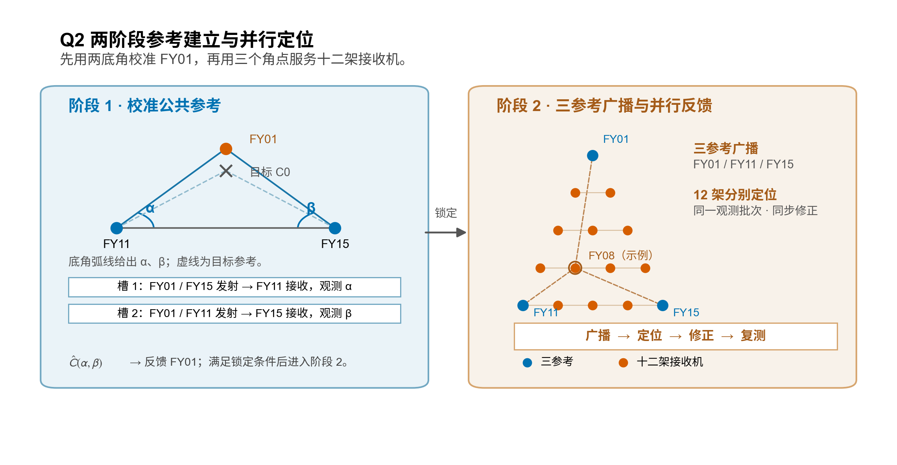
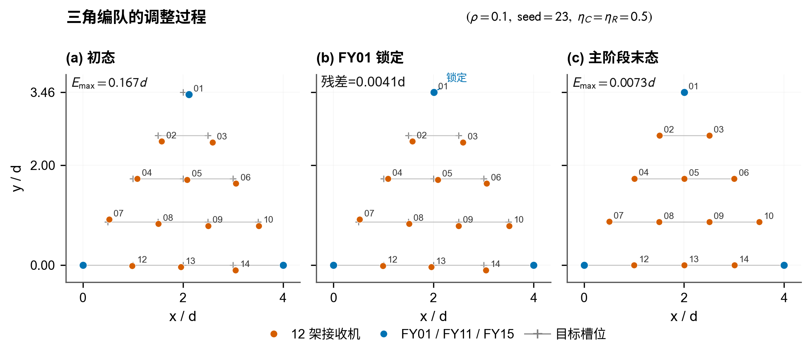
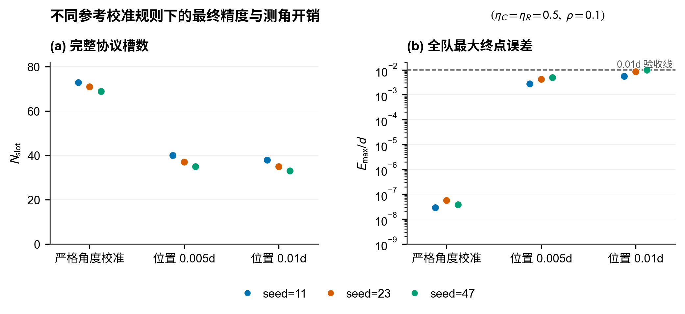

# 第二问：基于三角参考的编队调整方案

第二问要求在纯方位无源定位条件下，将无人机调整成图示的等间距编队。采用二维五层三角模板，设计两阶段调整方案：先固定底边两端，通过两个底角校准顶点 FY01；再由三个角点同时发射，其余 12 架分别定位、并行修正，直至满足停止条件。参考校准精度根据最终编队误差要求确定。

## 1. 目标队形与模型约定

15 架无人机按五层编号：FY01；FY02–FY03；FY04–FY06；FY07–FY10；FY11–FY15。以相邻间距为单位，取 $d=1$，第 $r$ 层、第 $c$ 个位置的目标坐标为

$$
Q_{r,c}=\left(2-\frac r2+c,\;2\sqrt3-\frac{\sqrt3}{2}r\right),
\qquad r=0,\ldots,4,\quad c=0,\ldots,r.
$$

固定 FY11、FY15 的当前位置，分别定义为 $A=(0,0)$、$B=(4,0)$；顶点目标为 $C_0=Q_1=(2,2\sqrt3)$。这样确定编队的平移、朝向和尺度。实际底边长度为 $L_{AB}$ 时，编队相邻间距为 $L_{AB}/4$；题面的 $50\,\mathrm m$ 可作为展示尺度，绝对长度需要外部尺度信息。

初态假设位于编号模板对应的相似队形附近，并保持 FY01 在底边上侧。每个观测批次内各机静止，动作在统一编队坐标中准确执行，忽略调整时间。这给出了本方案的局部几何和执行条件。定位计算使用编号、夹角和参考模板，仿真另保存真实位置用于生成观测及评价结果。

## 2. 两底角定位与参考校准

初始角点也可能偏离目标，需要先建立可靠的参考三角形。FY01 的一轮观测安排如下。

| 测角槽 | 发射无人机 | 接收无人机 | 得到的夹角 |
|---|---|---|---|
| 1 | FY01、FY15 | FY11 | $\alpha=\angle CAB$ |
| 2 | FY01、FY11 | FY15 | $\beta=\angle CBA$ |

两次观测期间 FY01 保持不动，两个角度标量回传给估计端。由正弦定理，FY01 在底边上侧的位置为

$$
\hat C=\frac{4\sin\beta}{\sin(\alpha+\beta)}
\begin{bmatrix}\cos\alpha\\\sin\alpha\end{bmatrix},
\qquad \alpha>0,\quad\beta>0,\quad\alpha+\beta<\pi.
$$

将估计位置与目标比较，按 $\Delta C=-\eta_C(\hat C-C_0)$ 修正，即 $C^+=C+\Delta C$，随后重新测量两个底角。精确测角时，当 $\lVert\hat C-C_0\rVert\le\tau_C$，固定 FY01，进入下一阶段；$\tau_C$ 的选择见第 4 节。



*图 1 两阶段调整方法示意。第一阶段用两个静止测角槽确定 FY01；第二阶段三个角点共享一次广播，为其余 12 架提供定位参考。*

## 3. 三参考定位与并行反馈

锁定 FY01、FY11、FY15 后，三机在同一测角槽中发射，12 架接收机各自得到发射对 $(1,11)$、$(1,15)$、$(11,15)$ 的三个夹角。设接收机位置为 $p$、两参考位置为 $a,b$，对应的夹角模型为

$$
h(p;a,b)=\operatorname{atan2}\left(
|(a-p)\times(b-p)|,\;(a-p)\cdot(b-p)
\right).
$$

定位器采用目标参考坐标 $(C_0,A,B)$，从接收机的编号目标 $Q_i$ 启动局部求解。在目标处选择两条光滑、独立的角约束组成集合 $\mathcal S_i$，估计位置为

$$
\hat p_i=\arg\min_{p\ \text{位于}\ Q_i\ \text{附近}}
\sum_{(j,k)\in\mathcal S_i}
\left[h(p;Q_j,Q_k)-\alpha_{i,jk}^{\mathrm{obs}}\right]^2.
$$

两条独立角约束在局部确定二维位置，计算后用全部三个夹角复核观测一致性。底边上的 FY12–FY14 对 FY11/FY15 的夹角为 $\pi$，这三架选取另外两条光滑角约束求解。若几何或求解检查失败，记录失败并停止该接收机的更新。

通过检查后，每架接收机计算 $\Delta p_i=-\eta_R(\hat p_i-Q_i)$。全部接收机使用同一静止批次的观测，再同时执行 $p_i^+=p_i+\Delta p_i$。下一槽重新测角，重复定位与修正；满足本机估计位置阈值的接收机保持位置，所有接收机均满足条件且没有失败时结束协议。

增益 $0<\eta_C,\eta_R\le1$ 分别控制参考和接收机的修正幅度。在准确反演与理想执行下，单位增益可一次消除对应位置偏差；较小增益分多次修正。重复测量存在噪声时，增益结合固定观测预算下的实测精度选择，相关结果见[测角误差与增益分析](../../docs/q2/测角误差与增益选择.md)。

## 4. 停止条件与精度要求

参考 FY01 校准后的残差会影响全部接收机。记实际参考位置为 $C_0+\delta C$，在目标附近，接收机估计偏差满足 $\hat p_i-p_i\approx G_i\delta C$。当前三角模板的最大一阶传播倍率为 $G_{\max}=\max_i\lVert G_i\rVert_2\approx1.040833$。

因此，若最终全队允许的位置误差为 $E$，参考残差限值为 $\tau_C$，接收机的估计位置停止阈值为 $\tau_R$，可按下面的一阶预算选择参数：

$$
G_{\max}\tau_C+\tau_R+E_{\mathrm{rem}}\le E,
\qquad \tau_C\le E.
$$

$E_{\mathrm{rem}}$ 用于非线性余项及明确计入的其他误差。以 $E=0.01d$ 为例，若给参考传播分配 $0.005d$，得到 $\tau_C\le0.0048038d$。完整协议对照采用 $\tau_C=0.005d$、$\tau_R=0.0045d$，两项一阶贡献合计约 $0.0097042d$，并预留 $0.0002d$ 的非线性余量。该预算用于参数设计，实际达到的精度由完整仿真检验。

在线停止与离线验收分别使用下列量。

| 环节 | 判据 | 所需信息 |
|---|---|---|
| 参考锁定 | $\lVert\hat C-C_0\rVert\le\tau_C$ | 两底角位置估计 |
| 接收机保持 | $\lVert\hat p_i-Q_i\rVert\le\tau_R$，且完整三角拟合检查通过 | 本机夹角和参考模板 |
| 仿真精度验收 | $E_{\max}=\max_i\lVert p_i-Q_i\rVert\le E$ | 仿真真实位置，包括 FY01 |

含噪时，参考锁定还需计入测量不确定度，可用角度置信区间对应的位置集合检查预算，具体见[底角区间与位置预算](../../docs/q2/底角区间与位置预算.md)。本节示例协议采用精确测角；已有含噪结果按固定轮数末端精度评价。

## 5. 完整实例与测角开销

一次参考观测需要两槽、四发射机次，并回传两个角度标量；一次主广播需要一槽、三发射机次，可同时服务 12 架接收机。设参考观测为 $n_C$ 轮、主广播为 $n_R$ 次，计入移动后的复测，则完整开销为

$$
N_{\mathrm{slot}}=2n_C+n_R,\qquad
N_{\mathrm{tx}}=4n_C+3n_R.
$$

另记录各次位移之和 $D_{\mathrm{total}}=\sum_t\sum_i\lVert\Delta p_i^{(t)}\rVert$。共享广播使多架定位使用同一批发射信号；测角槽、发射机次和回传标量分别反映协议的资源需求。

第二问没有给出具体初始坐标表，采用固定规则生成扰动初态。图 2 使用同一案例：扰动参数 $\rho=0.1$、种子 23、两阶段增益均为 $0.5$，参考和接收机阈值分别为 $0.005d$、$0.0045d$。初始全队最大偏差为 $0.166974d$；参考阶段完成 6 轮观测，随后主阶段使用 7 次广播。完整流程为 19 槽、45 发射机次，累计位移 $1.115145d$，最终全队最大偏差为 $0.007269d$，满足示例 $0.01d$ 目标。



*图 2 同一轨迹的初态、参考锁定状态与最终队形。各面板使用相同坐标比例；中间状态仅完成 FY01 校准，最终状态由其余 12 架并行反馈得到。数据来自完整协议记录 case_084。*

基础精确模型另外检查了理想初态及四档扰动、每档三个种子，共 13 个初态，分别运行增益 $1$ 和 $0.5$，26 例均通过原有在线角度停止及离线 $10^{-6}d$ 精度标准。单位增益的 12 个非理想初态均为 6 槽、14 发射机次，包含两阶段各一次移动及复测。

## 6. 参考校准规则的对照

为单独观察参考校准规则的影响，固定增益 $\eta_C=\eta_R=0.5$，采用相同的三个初态（种子 11、23、47），比较严格角度校准、位置阈值 $0.005d$ 和 $0.01d$。此对照中，三组主阶段均采用原 $10^{-8}\,\mathrm{rad}$ 目标角停止条件。



*图 3 不同参考校准规则下的完整测角槽数和实际全队最大终点误差。每类展示三个相同初态的结果，误差轴采用对数刻度，虚线为示例全队 $0.01d$ 验收线。*

| FY01 校准规则 | 完整测角槽 | 完整发射机次 | 全队最大终点误差范围 / $d$ |
|---|---:|---:|---:|
| 严格角度 $10^{-8}\,\mathrm{rad}$ | 69–73 | 163–171 | $2.94\times10^{-8}$–$5.74\times10^{-8}$ |
| 位置阈值 $0.005d$ | 35–40 | 95–106 | 0.002790–0.004955 |
| 位置阈值 $0.01d$ | 33–38 | 91–102 | 0.005579–0.009910 |

在这三个固定初态中，有限校准减少了测角开销，同时保留较大的终点误差，九例均满足示例 $0.01d$ 目标。单位增益下三种校准规则均为六槽，其成本由精确反演和一次修正决定。参数应结合所需精度和完整流程选择。

进一步按第 4 节的共同位置预算比较两阶段与同步参考协议，共 30 例均达到 $0.01d$；同步方案在所测案例中没有统一的测角成本优势。含噪固定预算实验覆盖三档噪声及不同阶段增益，可用于选择参数，详细数据和几何适用范围见[方法推导与模型检验](../../docs/q2/方法推导与模型检验.md)。

## 7. 代码与材料入口

[q2.py](../../scripts/q2/q2.py) 集中实现本方案及配套分析，单独复制即可运行；命令见[代码说明](../../scripts/q2/README.md)。[资料索引](../../docs/q2/资料索引.md)列出公式、三张图及各表的原始数据和复现入口。

```bash
conda run -n agent python scripts/q2/q2.py triangle --output-dir scratch/q2_reproduction/triangle
conda run -n agent python scripts/q2/q2.py protocols --output-dir scratch/q2_reproduction/protocols
conda run -n agent python scripts/q2/build_paper_assets.py
```
